# Week 0 — Billing and Architecture
# Week 0 Journal 

## Tasks Status
1. Watch AB's week 0 stream :white_check_mark:
2. Watch Ashish's week 0 security video :white_check_mark:
3. Watch Chirag's week 0 cost video :white_check_mark:
4. Security quiz :white_check_mark:
5. Pricing quiz :white_check_mark:
6. Recreate Conceptual Diagram in Lucid Charts or on a Napkin :white_check_mark:
7. Recreate Logical Architectual Diagram in Lucid Charts :white_check_mark:
8. Create an Admin User :white_check_mark:
9. Use CloudShell :white_check_mark:
10. Generate AWS Credentials :white_check_mark:
11. Installed AWS CLI :white_check_mark:
12. Create a Billing Alarm :white_check_mark:
13. Create a Budget :white_check_mark:
14. Scrubbed personal info from Github commit hostory using bfg ✅


## Personal Milestones
1. First ever *Git commit*! :blush:
2. Learned how to write *Markdown code*! :blush:
3. Also learnt how to clear Github history!!

Hurray for me!! :clap: :clap: :clap:


===========================================================================================

## :bow: Week 0 Assignment :running:

### Recreate Cruddur Logical Architectural diagram   
[Lucid Charts Share Link](https://lucid.app/lucidchart/8d5dfa2d-fe47-4651-95bd-bb6cf43d7356/edit?invitationId=inv_c1df9702-362d-415a-a6d5-9024b1a64169)
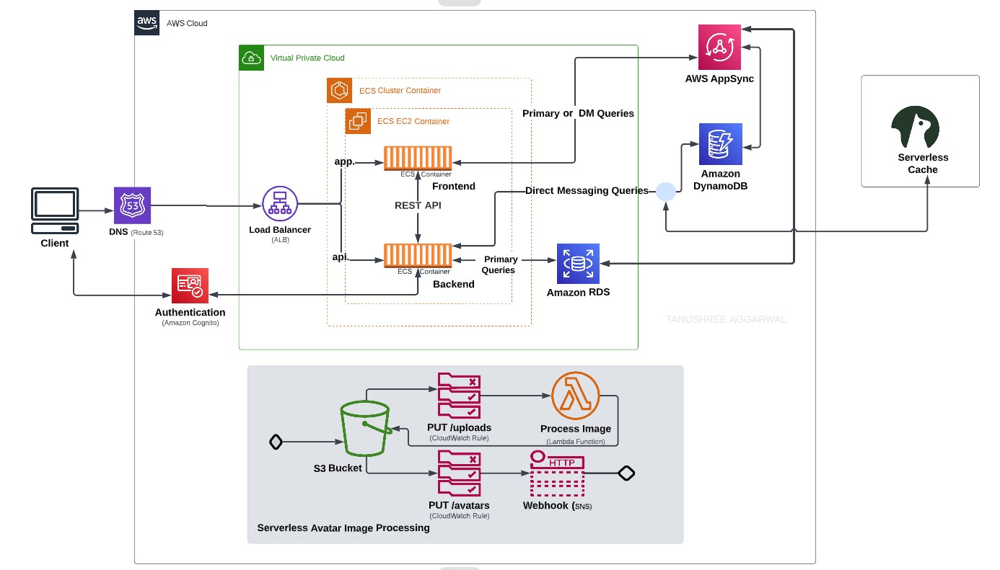


### Crudder Conceptual diagram - Napkin design
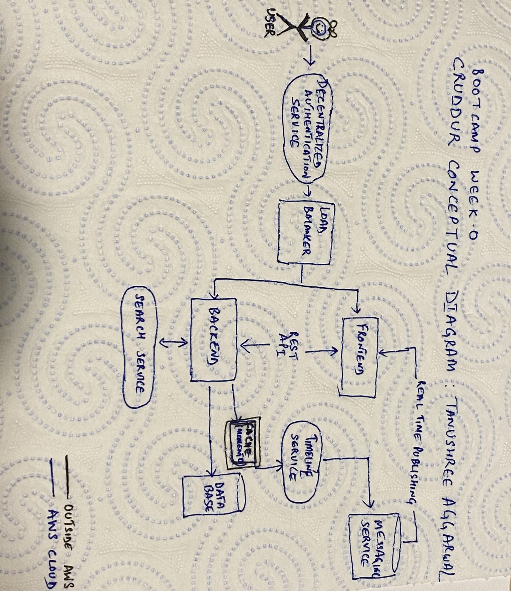

### Enable MFA for root user :zap: :zap: :zap: :lock:
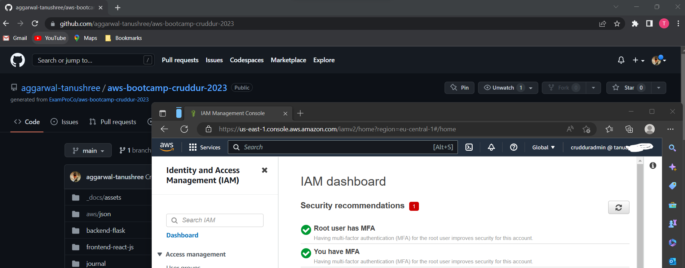

### Created IAM user "crudduradmin"
- Enabled MFA for _crudduradmin_ :lock:
- Generated access key :key:
- Created an *admin* group with the required permissions and added _crudduradmin_ to the group, instead of assigning permissions directly to the user
- Assigned *Tags* to _crudduradmin_ ,so cost usage can be tracked using these 
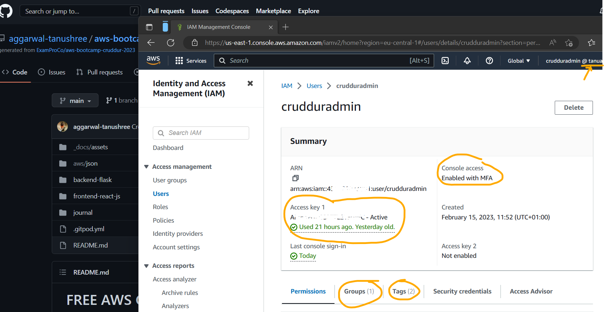

### Install and Verify AWS CLI
- I installed the AWS CLI using the Gitpod terminal. For the installation I followed the [AWS CLI documentation for Unix](https://docs.aws.amazon.com/cli/latest/userguide/getting-started-install.html) 
 
 ```
 cd /workspaces
 curl "https://awscli.amazonaws.com/awscli-exe-linux-x86_64.zip" -o "awscliv2.zip"
 unzip awscliv2.zip
 sudo ./aws/install
 ```
 I verified the installation using:
 `
 aws --version
 `
   
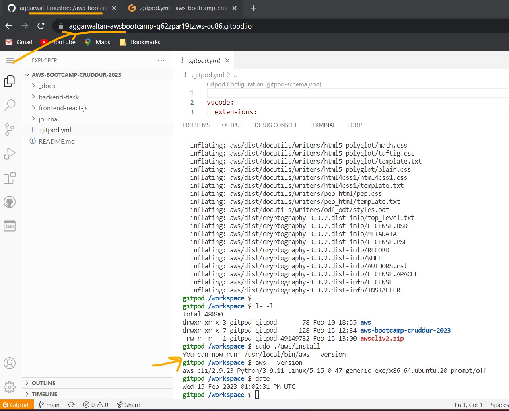

- The installation is not permanent and would have been lost when Gitpod workspace was closed/restarted. So, i added the installation steps to _gitpod.yml_ file and commited the file in my github repository. 

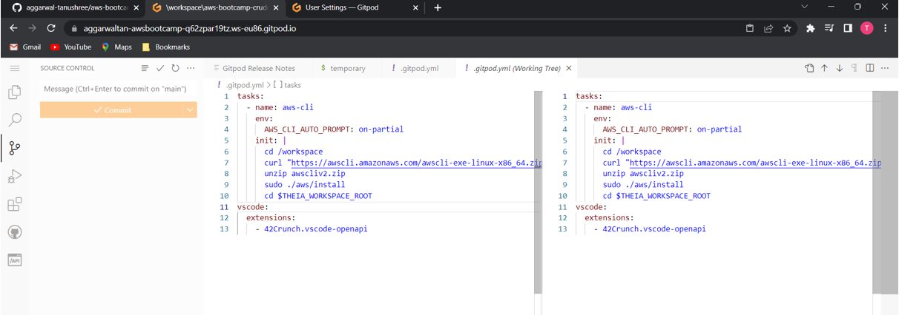

- I also added _crudduradmin_ credentials to Gitopd environment variables

- verified that the _gitpod.yml_ file was indeed checked-in my github repository
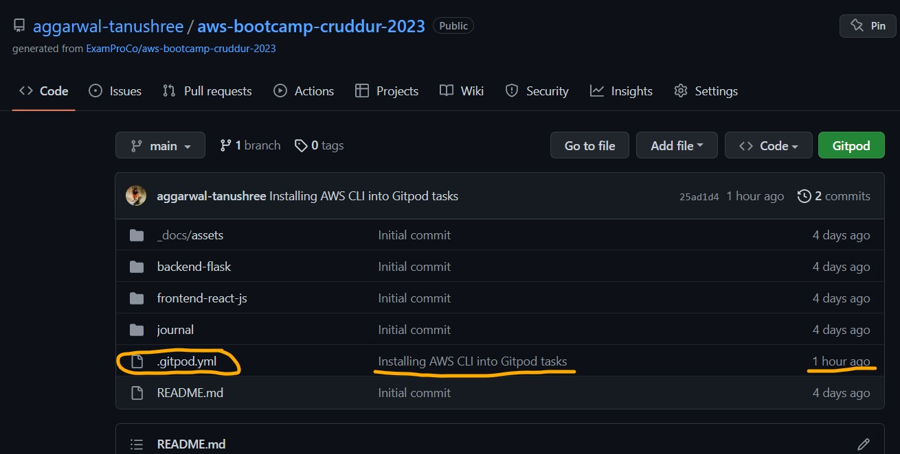

- Relaunched gitpod workspace to verify AWS CLI installation
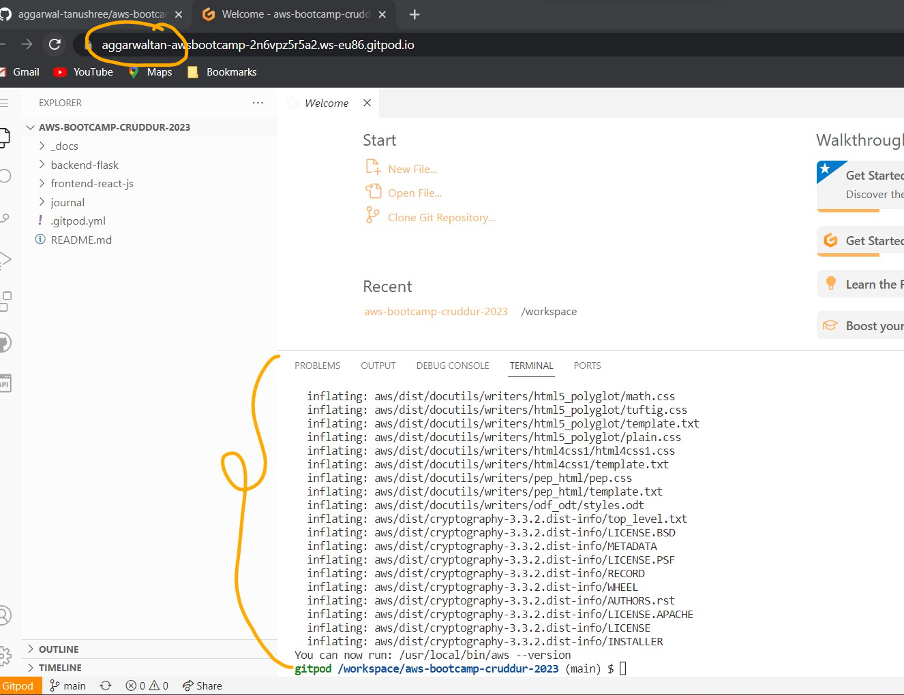

- Verified _crudduradmin_ credentials availability in the environemnt by issuing the aws CLI command to return caller identity:

    `aws sts get-caller-identity`
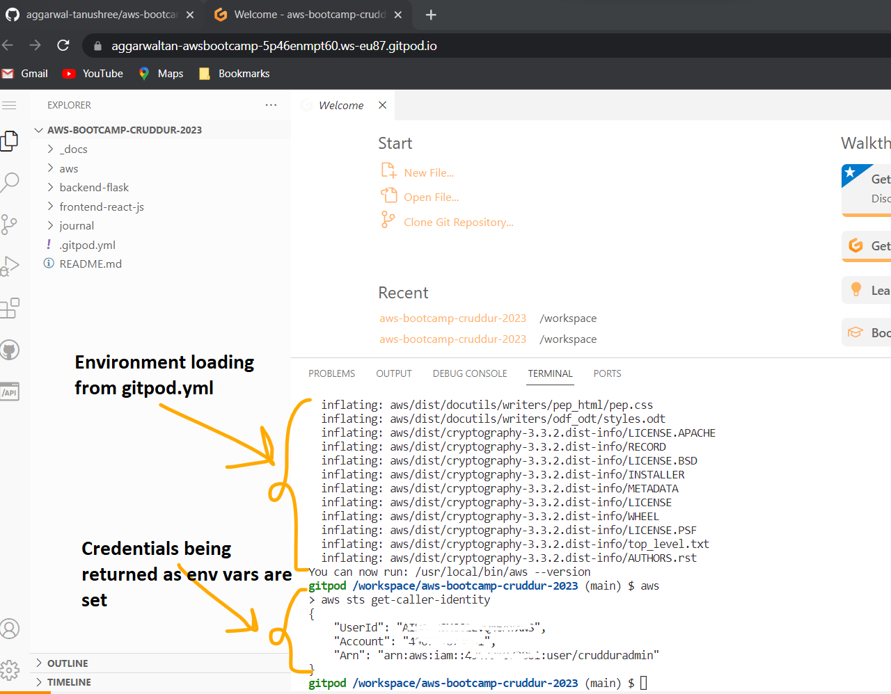


### Created a Cost Budget via AWS CLI
_Note_: :book: :book:

[budget.json is commited here](https://github.com/aggarwal-tanushree/aws-bootcamp-cruddur-2023/blob/main/aws/json/budget.json)

[budget-notifications-with-subscribers.json is commited here](https://github.com/aggarwal-tanushree/aws-bootcamp-cruddur-2023/blob/main/aws/json/budget-notifications-with-subscribers.json)

I created a $1 cost spend monthly budget. It will alert me via email when I cross the defined 80% threshold and also when the budget exceeds $1 spend per month.
_Note_:
Chirag showed how to create a Credit budget as well which I have not created, since I do not have any AWS Credits linked to my account._
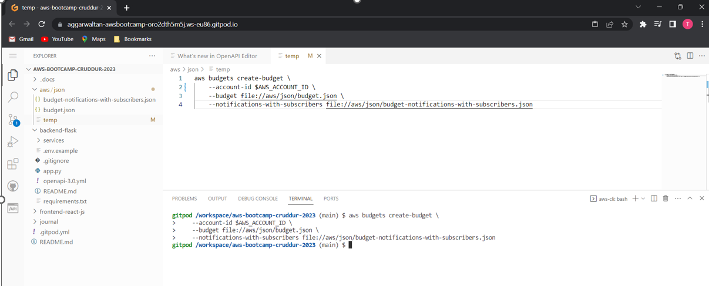

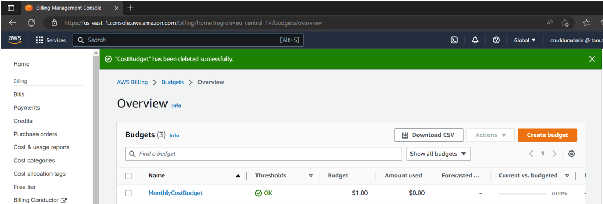

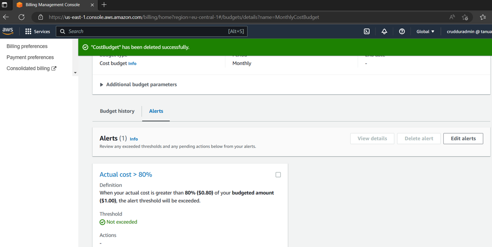

### Created a Billing Alarm via AWS CLI
I enabled a billing alarm via AWS CLI - It will alert me as soon as the threshold amount $1 is exceeded.
_Note_:  :book: :book:

[Billing alarm json is commited here](https://github.com/aggarwal-tanushree/aws-bootcamp-cruddur-2023/blob/main/aws/json/billing-alarm.json)

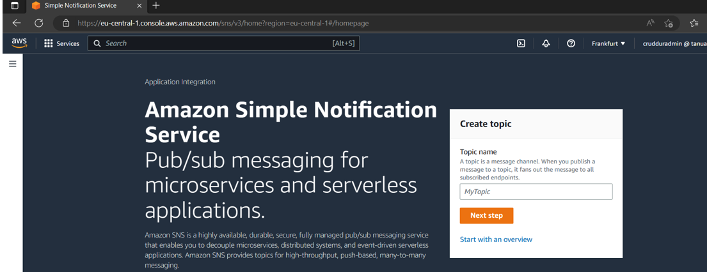

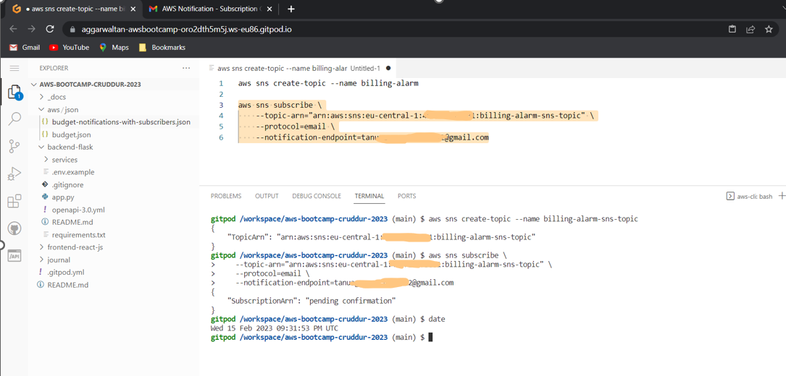

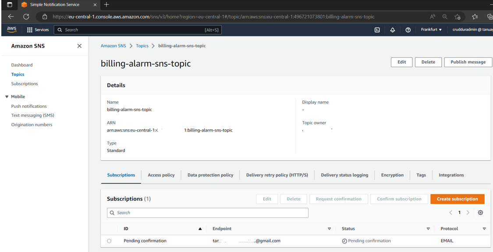

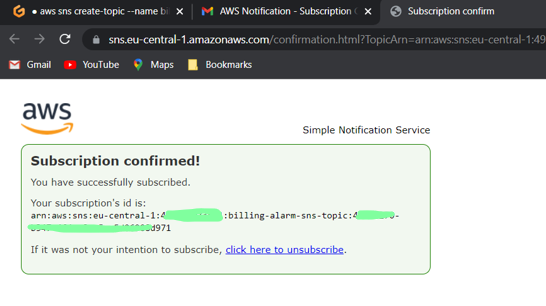

Then I verified the same on the AWS Management Console in *CloudWatch* service
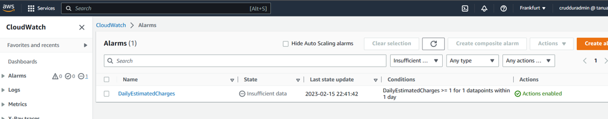
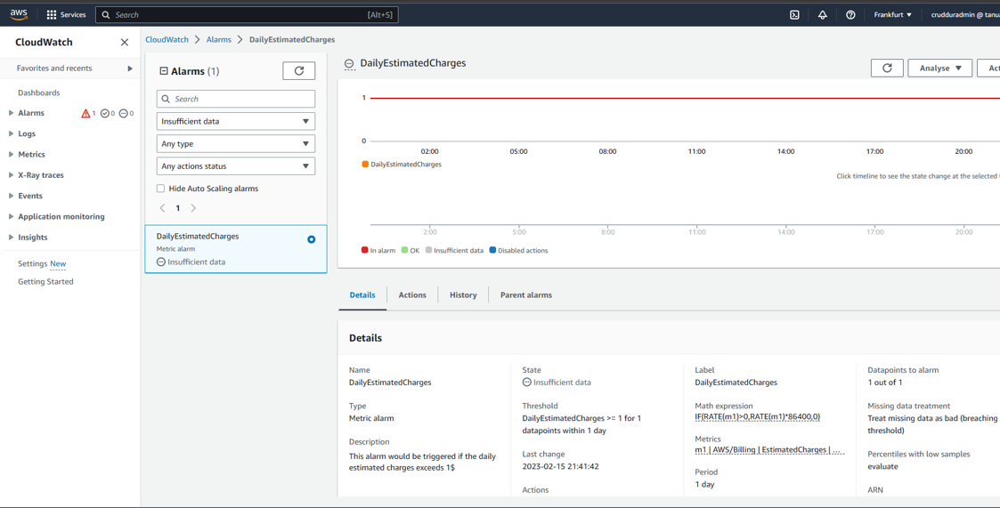

### Launched AWS CloudShell and played around a bit
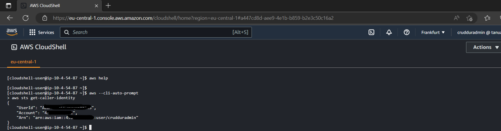

### Scrubbed off personal information from Github history using bfg
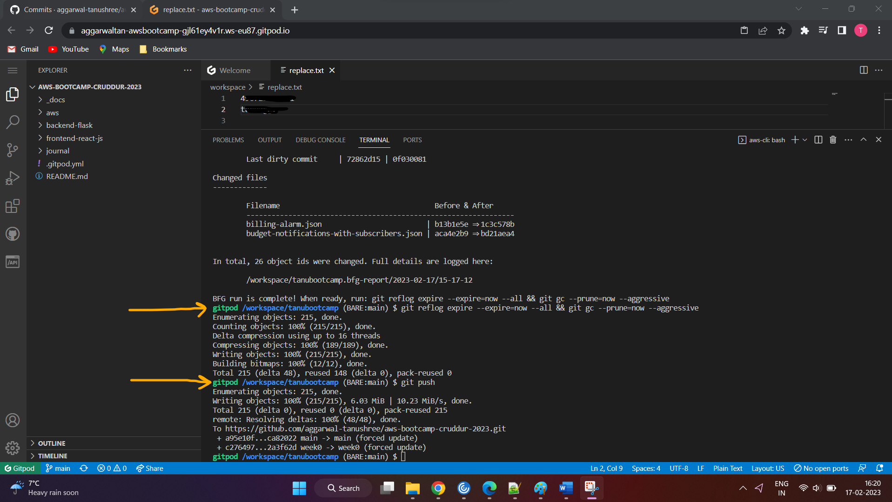


===========================

