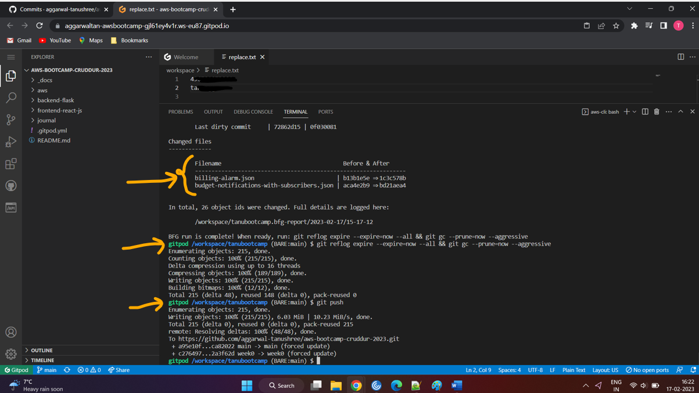

# Week 0 — Billing and Architecture
# Week 0 Journal 

## Tasks Status
1. Watch AB's [week 0 stream](https://www.youtube.com/watch?v=SG8blanhAOg&list=PLBfufR7vyJJ7k25byhRXJldB5AiwgNnWv&index=12) :white_check_mark:
2. Watch Ashish's [week 0 security video](https://www.youtube.com/watch?v=4EMWBYVggQI&list=PLBfufR7vyJJ7k25byhRXJldB5AiwgNnWv&index=15) :white_check_mark:
3. Watch Chirag's [week 0 cost video](https://www.youtube.com/watch?v=OVw3RrlP-sI&list=PLBfufR7vyJJ7k25byhRXJldB5AiwgNnWv&index=13) :white_check_mark:
4. Security quiz :white_check_mark:
5. Pricing quiz :white_check_mark:
6. Recreate Conceptual Diagram in Lucid Charts or on a Napkin :white_check_mark:
7. Recreate Logical Architectual Diagram in Lucid Charts :white_check_mark:
8. Create an Admin User :white_check_mark:
9. Use CloudShell :white_check_mark:
10. Generate AWS Credentials :white_check_mark:
11. Installed AWS CLI :white_check_mark:
12. Create a Billing Alarm :white_check_mark:
13. Create a Budget :white_check_mark:
14. Go through [Spend Considerations document](https://docs.google.com/document/d/10Hec7Or1ZUedl0ye-05mVPhYFR5-ySh2K8ZbFqTxu1w/) ✅
15. Scrubbed personal info from Github commit history using bfg ✅


## Personal Milestones
1. First ever *Git commit*! :blush:
2. Learned how to write *Markdown code*! :blush:
3. Also learnt how to clear Github history!!

Hurray for me!! :clap: :clap: :clap:


===========================================================================================

## :bow: Week 0 Assignment :running:

### Recreate Cruddur Logical Architectural diagram   
[Lucid Charts Share Link](https://lucid.app/lucidchart/8d5dfa2d-fe47-4651-95bd-bb6cf43d7356/edit?invitationId=inv_c1df9702-362d-415a-a6d5-9024b1a64169)


### Crudder Conceptual diagram - Napkin design


### Enable MFA for root user :zap: :zap: :zap: :lock:


### Created IAM user "crudduradmin"
- Enabled MFA for _crudduradmin_ :lock:
- Generated access key :key:
- Created an *admin* group with the required permissions and added _crudduradmin_ to the group, instead of assigning permissions directly to the user
- Assigned *Tags* to _crudduradmin_ ,so cost usage can be tracked using these 


### Install and Verify AWS CLI
- I installed the AWS CLI using the Gitpod terminal. For the installation I followed the [AWS CLI documentation for Unix](https://docs.aws.amazon.com/cli/latest/userguide/getting-started-install.html) 
 
 ```
 cd /workspaces
 curl "https://awscli.amazonaws.com/awscli-exe-linux-x86_64.zip" -o "awscliv2.zip"
 unzip awscliv2.zip
 sudo ./aws/install
 ```
 I verified the installation using:
 `
 aws --version
 `
   


- The installation is not permanent and would have been lost when Gitpod workspace was closed/restarted. So, i added the installation steps to _gitpod.yml_ file and commited the file in my github repository. 


- I also added _crudduradmin_ credentials to Gitopd environment variables

- verified that the _gitpod.yml_ file was indeed checked-in my github repository


- Relaunched gitpod workspace to verify AWS CLI installation


- Verified _crudduradmin_ credentials availability in the environemnt by issuing the aws CLI command to return caller identity:

    `aws sts get-caller-identity`


### Created a Cost Budget via AWS CLI
_Note_: :book: :book:

[budget.json is commited here](https://github.com/aggarwal-tanushree/aws-bootcamp-cruddur-2023/blob/main/aws/json/budget.json)

[budget-notifications-with-subscribers.json is commited here](https://github.com/aggarwal-tanushree/aws-bootcamp-cruddur-2023/blob/main/aws/json/budget-notifications-with-subscribers.json)

I created a $1 cost spend monthly budget. It will alert me via email when I cross the defined 80% threshold and also when the budget exceeds $1 spend per month.
_Note_:
Chirag showed how to create a Credit budget as well which I have not created, since I do not have any AWS Credits linked to my account._


### Created a Billing Alarm via AWS CLI
I enabled a billing alarm via AWS CLI - It will alert me as soon as the threshold amount $1 is exceeded.
_Note_:  :book: :book:

[Billing alarm json is commited here](https://github.com/aggarwal-tanushree/aws-bootcamp-cruddur-2023/blob/main/aws/json/billing-alarm.json)


Then I verified the same on the AWS Management Console in *CloudWatch* service


### Launched AWS CloudShell and played around a bit


### Scrubbed off personal information from Github history using bfg



===========================


## Personal Notes

### Chirag's Pricing Video
[week 0 Pricing video](https://www.youtube.com/watch?v=OVw3RrlP-sI&list=PLBfufR7vyJJ7k25byhRXJldB5AiwgNnWv&index=13)

- Some services are billed differently in different regions (check example)
- To setup clodwatch alarm for billing - we need to be in **US N. Virginia** region (as billing data is only visible in that region)
- **10 cloudwatch alarms** are free under **AWS free-tier**
- Budget service displays region as "global"
- **Billing Alarm** - received only when _actual threshold reached_ v/s **Budget Alarm** is an advanced service and has feature to predict usage and set _forecast alerts_ for defined threshold and also send _actual threshold_ alarm
- Cost Explorer - prepare financial reports, cost and usage reports (granualarity: daily, hourly etc. (hourly will show only for last 14 days), filter by region, cost tag etc.. Has default reports - eg: montly costs by service, etc.
- [AWS Calculator](https://calculator.aws/#/) Can be used to check pricing of various services (eg: EC2 - month can be 30 days (720 hrs) or 31 days(744hrs), but tool provides cost estimate for 730 hours-average of both)

### Ashish's Seurity Video
[week 0 Security video](https://www.youtube.com/watch?v=4EMWBYVggQI&list=PLBfufR7vyJJ7k25byhRXJldB5AiwgNnWv&index=15) 

##### AWS Organzations
- An account management service that lets you consolidate multiple AWS accounts into an organization that you create and centrally manage. 
- With Organizations, you can create member accounts and invite existing accounts to join your organization
- Feature is free to enable
- if consolidated billing enabled, the owner account is responsible for paying the bill for all associated accounts

##### CloudTrail
- Most APIs in AWS are logged in CloudTrail
- Can audit almost anything in your AWS a/c. 
- Can be used to :
 - Audit log for API calls
 - monitor data is in the correct place (monitor data residency)
 - understand regional v/s Global services
 - audit incident records/forensics
- CloudTrail stores the logs in Amazon S3 storage service bucket
- Allows ability to encrypt the data in that log bucket. Mechanisms: 	Aws KMS key mgmt. system

- What type of Events does CloudTrail log?
 - Management events (free) – management operations performed by AWS services
 - Data events (chargeable) – logs resource operations performed on or within  Aws resources	
 - Insight events (chargeable) – identifies API calls ( unusual activity, errors or user behaviour in an Aws account)

###### Management Events that can be monitored by CloudTrail:
 1. Read API
 2. Write API
3. Exclude AWS KMS events
4. Exclude Amazon RDS Data API events

###### Data Events 
 select the service name

###### Insights
 1. API call rate
 2. API error rate
 
 ##### IAM
 Types of IAM users
 
 1. Human users – Local AWS accounts for IAM 
 2. System users
 3. Federated users (eg: federated from on-prem environment)

 
_Enable MFA for all human users_
_Follow the principle of least privilege_
 
 
 
**Types of Policies:**
 1. AWS Managed
 2. Customer Managed

 
##### SCPs
 Enable to implement controls


