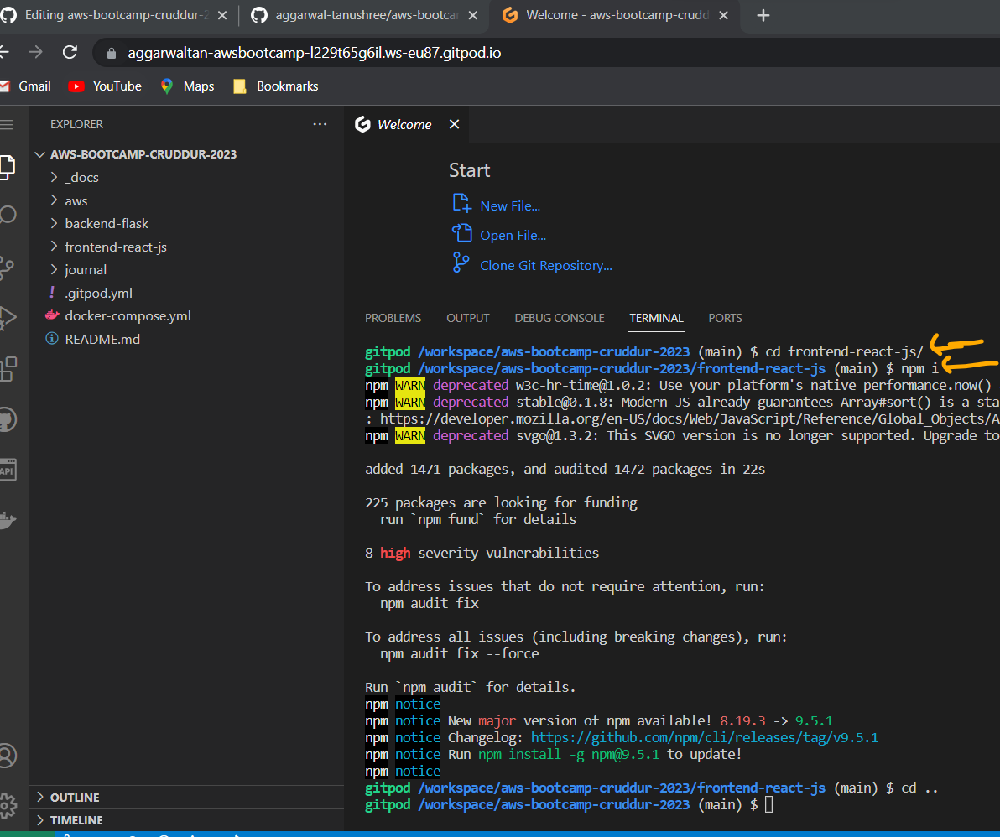

# Week 1 — App Containerization
# Week 1 Journal 

## Tasks Status
1. [Watch AB's week 1 stream](https://www.youtube.com/watch?v=zJnNe5Nv4tE&list=PLBfufR7vyJJ7k25byhRXJldB5AiwgNnWv&index=22) :white_check_mark:
2. [Watch Grading Homework Summaries](https://www.youtube.com/watch?v=FKAScachFgk&list=PLBfufR7vyJJ7k25byhRXJldB5AiwgNnWv&index=25) :white_check_mark:
3. [Watch Chirag's Week 1 - Spending Considerations](https://www.youtube.com/watch?v=OAMHu1NiYoI&list=PLBfufR7vyJJ7k25byhRXJldB5AiwgNnWv&index=24) :white_check_mark:
4. [Watch Remember to Commit Your Code](https://www.youtube.com/watch?v=b-idMgFFcpg&list=PLBfufR7vyJJ7k25byhRXJldB5AiwgNnWv&index=23)
5. [Watch Ashish's Week 1 - Container Security Considerations](https://www.youtube.com/watch?v=OjZz4D0B-cA&list=PLBfufR7vyJJ7k25byhRXJldB5AiwgNnWv&index=25)
6. [Watch Containerize Application (Dockerfiles, Docker Compose)](https://www.youtube.com/watch?v=zJnNe5Nv4tE&list=PLBfufR7vyJJ7k25byhRXJldB5AiwgNnWv&index=22)
7. [Document the Notification Endpoint for the OpenAI Document](https://www.youtube.com/watch?v=k-_o0cCpksk&list=PLBfufR7vyJJ7k25byhRXJldB5AiwgNnWv&index=27)
8. [Write a Flask Backend Endpoint for Notifications](https://www.youtube.com/watch?v=k-_o0cCpksk&list=PLBfufR7vyJJ7k25byhRXJldB5AiwgNnWv&index=27)
9. [Write a React Page for Notifications](https://www.youtube.com/watch?v=k-_o0cCpksk&list=PLBfufR7vyJJ7k25byhRXJldB5AiwgNnWv&index=27)
10. [Run DynamoDB Local Container and ensure it works](https://www.youtube.com/watch?v=CbQNMaa6zTg&list=PLBfufR7vyJJ7k25byhRXJldB5AiwgNnWv&index=28)
11. [Run Postgres Container and ensure it works](https://www.youtube.com/watch?v=CbQNMaa6zTg&list=PLBfufR7vyJJ7k25byhRXJldB5AiwgNnWv&index=28)


## Personal Milestones
1. Started Docker dummy and was able to deploy first ever Docker image! 👏 👏 ⭐
2.  

## Issues faced
1. While creating the _notifications_ feature, I ran into an issue. The backend [URL](https://4567-aggarwaltan-awsbootcamp-kr8sz8i6rnd.ws-eu87.gitpod.io/api/activities/notifications) when hit for /api/activities/notifications api endpoint gave me an error.

I did some troubleshooting and noticed a typo in **notifications_activities.py** file.
I had spelled the class as **NotificationsActivitie** instead of **NotificationsActivities** . Got it to work post making the correction.


Wroking!


## Week 1 Assignment proof 
**Note** : I have documented each of these tasks in great detail [here](#detailed-documentation)

#### Get Cruddur working


### Notification feature
**Note** : Detailed step-by-step documentation [here](#create-a-notification-feature)

##### Frontend


##### Backend


## Detailed documentation

[Watch AB's week 1 stream](https://www.youtube.com/watch?v=zJnNe5Nv4tE&list=PLBfufR7vyJJ7k25byhRXJldB5AiwgNnWv&index=22)

Containers
- good to use if you are working in development & testing
- a good way to ensure all OS dependencies, patch requirements etc.
 
-  linuxserver.io has lots of container images
	 
**[Dockerhub](hub.docker.com)** - a **container registry**, provided by Docker 	 to host your own container images for private purposed and/or share them used when you build your own container image and **push** to a container registry (eg: Dockerhub).
When someone wants to use this container image, they *pull** it from the registry
	
**OCI**  Open container images
- standards around how you build container images and registries etc.
- Docker hub follows OCI for registry
- As long as you use a container image following the OCI standards, it should be compatible with anything outside of Dockerhub
	
	
	 
Step 1: 
Create a **Dockerfile** under the **Backend** file structure
Paste the following code inside the _Dockerfile_

```
FROM python:3.10-slim-buster

WORKDIR /backend-flask

COPY requirements.txt requirements.txt
RUN pip3 install -r requirements.txt

COPY . .

ENV FLASK_ENV=development

EXPOSE ${PORT}
CMD [ "python3", "-m" , "flask", "run", "--host=0.0.0.0", "--port=4567"]
```

- Each line inside the Dockerfile is an instruction
- With each file we are creating a _layer_ per se 
- A docker file works on something called "union file system". Each layer of the Docker image is sandwitched together to form the final docker image

- ` FROM python:3.10-slim-buster ` : Loading a docker file "python:3.10-slim-buster"
- Here "[python](https://hub.docker.com/_/python)" is an image in Dockerhub 
- "[3.10-slim-buster](https://github.com/docker-library/python/blob/1a68bced0dc5b7deb6ecd2f7ddacc1089323409d/3.10/slim-buster/Dockerfile)" is one of the many available _tags_ in this docker image


- **[scratch](https://hub.docker.com/_/scratch)** is the name of an empty docker image. It is a minimal image reserved by Docker. It is used as a starting point for building containers.
While `scratch` appears in Docker’s repository on the hub, you can’t pull it, run it, or tag any image with the name scratch. Instead, you can refer to it in your Dockerfile. For example, to create a minimal container using scratch:

```FROM scratch
ADD rootfs.tar.xz /
CMD ["bash"]
```
- is copying "rootfs.tar.xz" to the root directory "/"
- executing the command "bash"


- Create **Dockerfile** under **backend-flask**
```
FROM python:3.10-slim-buster

# Inside Container
# make a new folder inside container
WORKDIR /backend-flask

# Outside Container -> Inside Container
# this contains the libraries want to install to run the app
COPY requirements.txt requirements.txt

# Inside Container
# Install the python libraries used for the app
RUN pip3 install -r requirements.txt

# Outside Container -> Inside Container
# . means everything in the current directory
# first period . - /backend-flask (outside container)
# second period . /backend-flask (inside container)
COPY . .

# Set Enviroment Variables (Env Vars)
# Inside Container and wil remain set when the container is running
ENV FLASK_ENV=development

EXPOSE ${PORT}

# CMD (Command)
# python3 -m flask run --host=0.0.0.0 --port=4567
CMD [ "python3", "-m" , "flask", "run", "--host=0.0.0.0", "--port=4567"]
```

**Make sure to commit the file**


**Let's try running Flask locally, before running the Docker image**

Installing pip3 
```cd backend-flask
pip3 install -r requirements.txt
```

Install the "flask" Python module, binding it to the i.p address "0.0.0.0" on port "4567" 
_By default flask would run on 127.0.0.1 localhost, but while running containers, we need to bind it to 0.0.0.0

`python3 -m flask run --host=0.0.0.0 --port=4567`


- Check the "ports" tab and click the "lock" button to "unlock" it and make it publically assessible.
- Click the "address" to open it in a new tab


- We get a "404" error - File not found

- So far we have been able to verify that our Flask server is running and accepting request
- It is however giving 404 error for the resource


**So we now troubleshoot!!**
- we just remebered that we forgot the set some environment variables, required for the app to work.
- Let's set these env vars and re-run our app!
`export FRONTEND_URL="*"`

`export BACKEND_URL="*"`


`export BACKEND_URL="*"`


- Try again and this time append to the app url "api/activities/home"


**RUN v/s CMD**
**RUN command is used to create a layer in the image of the docker file.
example: install a service
RUN is used setup process, things that we need to put in the container image.** 

**CMD is  - command that the container is going to run when it starts up
what will actually run inside the container when we run that container**


**Lets summarize what we have done so far**
We followed these commands on the Terminal to first run Flask locally 

```
Run Python
cd backend-flask
export FRONTEND_URL="*"
export BACKEND_URL="*"
python3 -m flask run --host=0.0.0.0 --port=4567
cd ..
make sure to unlock the port on the port tab
open the link for 4567 in your browser
append to the url to /api/activities/home
you should get back json
```


**Next up, let's run the container image!**
First, we need to remove the FRONTEND and BACKEND environment variables we set few steps back. This is a precautionaly step to ensure that these variables do not interfere with our actual environment.
_We can remove environment variables using the "unset" command_

`unset FRONTEND_URL`

`unset BACKEND_URL`

### Build Container Image
`docker build -t  backend-flask ./backend-flask`
- -t is for tagging a name.
- docker looked for the "Dockerfile" we created earlier in the "backend-flask" folder and used it to build the docker image 
- image was built in "./backend-flask", i.e. our "work directory"


We can see this image by click on the "Docker" extension.
Alternately, we can run the command:

` docker images	`


**Docker help**
` docker build --help `


### Run Container
` docker run --rm -p 4567:4567 -it backend-flask `

Let's check the app url to see if it works
_Note: we are expecting it to fail since we have not created the environment variables_


### Pro Tip: 
**You can debug while the container is being executed, by _RIGHT CLICK_ the image and _ATTACH SHELL_**
This opens a shell terminal and we can throubleshoot from here.


### Run Container again, this time with env vars
` docker run --rm -p 4567:4567 -it -e FRONTEND_URL='*' -e BACKEND_URL='*' backend-flask `


### Pro Tip:
**You can check the process details of a Container while it is running. Just open a new shell and type**

` docker ps `


## Let's install the FrontEnd our application now!

```
cd frontend-react-js
npm i
```


### Under "frontend-react-js" create a new "Dockerfile"

```
FROM node:16.18

ENV PORT=3000

COPY . /frontend-react-js
WORKDIR /frontend-react-js
RUN npm install
EXPOSE ${PORT}
CMD ["npm", "start"]
```


### Create docker-compose.yml at the project root dir

```
version: "3.8"
services:
  backend-flask:
    environment:
      FRONTEND_URL: "https://3000-${GITPOD_WORKSPACE_ID}.${GITPOD_WORKSPACE_CLUSTER_HOST}"
      BACKEND_URL: "https://4567-${GITPOD_WORKSPACE_ID}.${GITPOD_WORKSPACE_CLUSTER_HOST}"
    build: ./backend-flask
    ports:
      - "4567:4567"
    volumes:
      - ./backend-flask:/backend-flask
  frontend-react-js:
    environment:
      REACT_APP_BACKEND_URL: "https://4567-${GITPOD_WORKSPACE_ID}.${GITPOD_WORKSPACE_CLUSTER_HOST}"
    build: ./frontend-react-js
    ports:
      - "3000:3000"
    volumes:
      - ./frontend-react-js:/frontend-react-js

# the name flag is a hack to change the default prepend folder
# name when outputting the image names
networks: 
  internal-network:
    driver: bridge
    name: cruddur
 ```
 
 #### Right click this file and click, "Compose up"
 
 
 
 
 
 ### Make sure to unlock the ports for frontend and backend, and try launching the Frontend
 
 
 
 ### Moment of truth! Lets open the Frontend to see if it works!
 
 
 
 
 ====================================================================
 
 ## Create a Notification feature
 [AB's video](https://www.youtube.com/watch?v=k-_o0cCpksk&list=PLBfufR7vyJJ7k25byhRXJldB5AiwgNnWv&index=28)
 
 - OpenAPI previouslly called "Swagger", is a standard for open APIs
 - Many AWS services are integrated with OpenAPI (eg: API Gateway)
 - OpenAPI extension can be used to view the various API endpoints in our API file. (open the API file, and click the OpenAPI extension button to view this)
 - We can also get a preview of our avaibale API endpoints by clicking this highlighted button on the top right
 - OpenAPI is a good standard for documenting our APIs
 
 
 1. Launch Gitpod
 2. Install npm for the Frontend
	```
	cd frontend-react-js
	npm i
	```
	
	
3. Compose up _docker_compose.yml_
	(right click the file -> compose up)
	

4. Launch the frontend
5. Register yourself as a user (this is not fully implemented. Most values are hardcoded as of now)
6. For the activation code use **1234**
7. After logging in, notice your username is showing as a registered user on the _left tab_
8. Navigate to **Notifications** . You will notice an error. Notifications feature has not been coded yet, we will be doing this today!
	
	
[OpenAPI documentation](https://spec.openapis.org/oas/v3.1.0)

#### Let's add code for our notifications feature
9. We open and create a new API endpoint. 
 -  Open the file _openapi-3.0.yml_ and then open the OpenAPI extension
 -  Click the ... next to _PATHS_ and create click "OpenAPI: add new path" to add a new API endpoint.

	[new_api](assets/week1_new_api.png)
	
 -  Give it the name "/api/activities/notifications". Let's refer a similar existing endpoint and add the following code to our endpoint:	
	```
	/api/activities/notifications:
    get:
      description: 'Return a feed of activity for all those I follow'
      tags: 
        - activities
      parameters: []
      responses:
        '200':
          description: Returns an array of activities
          content:
            application/json:
              schema:
                type: array
                items:
                  $ref: '#/components/schemas/Message'
	
	```
	
	
	
	- Commit _openapi-3.0.yml_

#### Next, we modify **app.py** and add code for the notifications api
1. Open _app.py_
2. Search for the exiting api _/api/activities/home_
3. Copy its code and paste below it. We will use this as a sample to create _/api/activities/notifications_
```
	@app.route("/api/activities/notifications", methods=['GET'])
	def data_notifications():
 	 data = NotificationsActivities.run()
  	return data, 200

```
4. Create a new file **notifications_activites.py** under **services**
5. At line 7 of **app.py** (just below _from services.home_activities import *_ ) add the below code
	`from services.notifications_activities import *`

	

6. Open the newly created **notifications_activites.py** and copy-paste the contents of **home_activites.py** (we can use the same code as home_activities.py as both these api's are using the same schema)
Modify the __notifications_activities.py__ to add some dummy data
example:
```
from datetime import datetime, timedelta, timezone
class NotificationsActivities:
  def run():
    now = datetime.now(timezone.utc).astimezone()
    results = [{
      'uuid': '68f126b0-1ceb-4a33-88be-d90fa7109eee',
      'handle':  'Tanushree Aggarwal',
      'message': 'Loving this bootcamp!',
      'created_at': (now - timedelta(days=2)).isoformat(),
      'expires_at': (now + timedelta(days=5)).isoformat(),
      'likes_count': 5,
      'replies_count': 1,
      'reposts_count': 0,
      'replies': [{
        'uuid': '26e12864-1c26-5c3a-9658-97a10f8fea67',
        'reply_to_activity_uuid': '68f126b0-1ceb-4a33-88be-d90fa7109eee',
        'handle':  'Worf',
        'message': 'This post has a lot of honor!',
        'likes_count': 0,
        'replies_count': 0,
        'reposts_count': 0,
        'created_at': (now - timedelta(days=2)).isoformat()
      }],
    },
    ]
    return results

```

7. Launch the backend [url](https://4567-aggarwaltan-awsbootcamp-kr8sz8i6rnd.ws-eu87.gitpod.io/api/activities/notifications):  it will give a 404 (not found) error.
Append the notifications api endpoint to it, and check the output.
It works! Notice the output json 
```
"handle": "Tanushree Aggarwal",
    "likes_count": 5,
    "message": "Loving this bootcamp!",
```


8. Commit and sync both files to Github repo **app.py** and **notifications_activities.py**

#### Next up, we work on the frontend code for Notifications feature
1. Navigate to **App.js** under the **frontend_react_js** file structure
2. We need to create a page for notifications
3. Paste the below code at line 4(the exact location  does not matter, just make sure it is imported along with the other pages)
	` import NotificationsFeedPage from './pages/NotificationsFeedPage'; `
**Note:** it is grayed out since we have not created this file yet. Don't worry we will create it i a moment
**Note:** we also noticed `import process from 'process';` at line 13 is grayed out, it we have not created it. We can delete this line of code.

4. Next we add the below code to define a path for _notifications_
```  
	  {
    		path: "/notifications",
    		element: <NotificationsFeedPage />
  	   },
  ```
5. Taking **pages/HomeFeedPage.js** as reference, create **pages/NotificationsFeedPage.js**. Refer code below
  
 ```
 import './NotificationsFeedPage.css';
import React from "react";

import DesktopNavigation  from '../components/DesktopNavigation';
import DesktopSidebar     from '../components/DesktopSidebar';
import ActivityFeed from '../components/ActivityFeed';
import ActivityForm from '../components/ActivityForm';
import ReplyForm from '../components/ReplyForm';

// [TODO] Authenication
import Cookies from 'js-cookie'

export default function HomeFeedPage() {
  const [activities, setActivities] = React.useState([]);
  const [popped, setPopped] = React.useState(false);
  const [poppedReply, setPoppedReply] = React.useState(false);
  const [replyActivity, setReplyActivity] = React.useState({});
  const [user, setUser] = React.useState(null);
  const dataFetchedRef = React.useRef(false);

  const loadData = async () => {
    try {
      const backend_url = `${process.env.REACT_APP_BACKEND_URL}/api/activities/notifications`
      const res = await fetch(backend_url, {
        method: "GET"
      });
      let resJson = await res.json();
      if (res.status === 200) {
        setActivities(resJson)
      } else {
        console.log(res)
      }
    } catch (err) {
      console.log(err);
    }
  };

  const checkAuth = async () => {
    console.log('checkAuth')
    // [TODO] Authenication
    if (Cookies.get('user.logged_in')) {
      setUser({
        display_name: Cookies.get('user.name'),
        handle: Cookies.get('user.username')
      })
    }
  };

  React.useEffect(()=>{
    //prevents double call
    if (dataFetchedRef.current) return;
    dataFetchedRef.current = true;

    loadData();
    checkAuth();
  }, [])

  return (
    <article>
      <DesktopNavigation user={user} active={'home'} setPopped={setPopped} />
      <div className='content'>
        <ActivityForm  
          popped={popped}
          setPopped={setPopped} 
          setActivities={setActivities} 
        />
        <ReplyForm 
          activity={replyActivity} 
          popped={poppedReply} 
          setPopped={setPoppedReply} 
          setActivities={setActivities} 
          activities={activities} 
        />
        <ActivityFeed 
          title="Home" 
          setReplyActivity={setReplyActivity} 
          setPopped={setPoppedReply} 
          activities={activities} 
        />
      </div>
      <DesktopSidebar user={user} />
    </article>
  );
}
 ```
  
6. also create a blank **pages/NotificationsFeedPage.css** for any css we may require to add.


8. Navigate to **pages/DesktopNavigation.js** and verify presence of **notifications** endpoint
```
	notificationsLink = <DesktopNavigationLink 
      url="/notifications" 
      name="Notifications" 
      handle="notifications" 
```
 
9. **We are all set! Refresh the Fronend url for** [notifications](https://4567-aggarwaltan-awsbootcamp-kr8sz8i6rnd.ws-eu87.gitpod.io/api/activities/notifications) feature.


**We just completed implementing a part of the Notifications feature for our Cruddur app!** Hooray to us!!

 ====================================================================
 
 ====================================================================
 
 ====================================================================
 
 ## Personal Notes


[Spend consideration video](https://www.youtube.com/watch?v=OAMHu1NiYoI)

## GitPod
Provides the cloud development environment
Free tier 
	- 50 hours of Standard workspace usage per month
	- Free tier standard configuration: 4 cores, 8GB RAM and 30GB storage
	- Large configuration: 8 cores, 16GB RAM and 50GB storage
	- Environemnt automatically stops after 30 minutes of in-activity
	- Upto 4 parallel workspaces are supported (should try not to spin up multiple environemtns simultaneously, as usage is aggregated)

_**Note** : Bootcamp requires average of 2 hours compute per week. Even if we go up to 11 hours compute per week, with standard configuration, we can stay within the free-tier limits_

To check pricing models:
[Gitpod pricing page](https://www.gitpod.io/pricing)


To check current usage:
[Gitpod billing console](https://gitpod.io/user/billing)


## Github Codespaces

- With configuration: 2 cores, 4GB RAM, 15GB storage : 60 hours usage per month
 
- With configuration: 4 cores, 8GB RAM, 15GB storage : 30 hours usage per month


As configuration increases, free usage hours decreases

_**Note** maximum storage supported : **32 GB**_

To check pricing models:
[Github Codespaces pricing](https://github.com/features/codespaces)


## AWS Cloud 9
- An independent platform acquired by AWS a few years ago
- Uses EC2 as underlying technology
- Can run AWS Cloud 9 free for the entire month, if using EC2 **t2.micro** or **t3.micro** instance type
- Avoid using Cloud 9 if t2.micro is being used for other purposes within the account, as **usage bill is aggregated**
 
 
## CloudTrail
- API logging service
- Logs trails in S3 buckets
- By default, all trails are logged for **90 days**
- To stay in free tier usgae limits, follow these steps:
	1. uncheck the option to "Log file SSE-KMS encryption" (as KMS encryption operations can be expensive)
	2. For logging "Event types", uncheck "Data events" and "Insights events" -> as these are not free tier eligible. These event logging are betetr sutited for production environments
