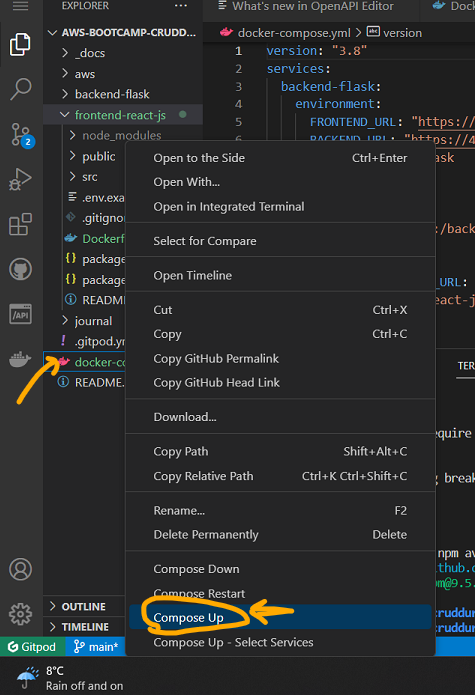

# Week 1 — App Containerization
# Week 1 Journal 

## Tasks Status
1. [Watch AB's week 1 stream](https://www.youtube.com/watch?v=zJnNe5Nv4tE&list=PLBfufR7vyJJ7k25byhRXJldB5AiwgNnWv&index=22) :white_check_mark:
2. [Watch Grading Homework Summaries](https://www.youtube.com/watch?v=FKAScachFgk&list=PLBfufR7vyJJ7k25byhRXJldB5AiwgNnWv&index=25) :white_check_mark:
3. [Watch Chirag's Week 1 - Spending Considerations](https://www.youtube.com/watch?v=OAMHu1NiYoI&list=PLBfufR7vyJJ7k25byhRXJldB5AiwgNnWv&index=24) :white_check_mark:
4. [Watch Remember to Commit Your Code](https://www.youtube.com/watch?v=b-idMgFFcpg&list=PLBfufR7vyJJ7k25byhRXJldB5AiwgNnWv&index=23) :white_check_mark:
5. [Watch Ashish's Week 1 - Container Security Considerations](https://www.youtube.com/watch?v=OjZz4D0B-cA&list=PLBfufR7vyJJ7k25byhRXJldB5AiwgNnWv&index=25) :white_check_mark:
6. [Watch Containerize Application (Dockerfiles, Docker Compose)](https://www.youtube.com/watch?v=zJnNe5Nv4tE&list=PLBfufR7vyJJ7k25byhRXJldB5AiwgNnWv&index=22) :white_check_mark:
7. [Document the Notification Endpoint for the OpenAI Document](https://www.youtube.com/watch?v=k-_o0cCpksk&list=PLBfufR7vyJJ7k25byhRXJldB5AiwgNnWv&index=27) :white_check_mark:
8. [Write a Flask Backend Endpoint for Notifications](https://www.youtube.com/watch?v=k-_o0cCpksk&list=PLBfufR7vyJJ7k25byhRXJldB5AiwgNnWv&index=27) :white_check_mark:
9. [Write a React Page for Notifications](https://www.youtube.com/watch?v=k-_o0cCpksk&list=PLBfufR7vyJJ7k25byhRXJldB5AiwgNnWv&index=27) :white_check_mark:
10. [Run DynamoDB Local Container and ensure it works](https://www.youtube.com/watch?v=CbQNMaa6zTg&list=PLBfufR7vyJJ7k25byhRXJldB5AiwgNnWv&index=28) :white_check_mark:
11. [Run Postgres Container and ensure it works](https://www.youtube.com/watch?v=CbQNMaa6zTg&list=PLBfufR7vyJJ7k25byhRXJldB5AiwgNnWv&index=28) :white_check_mark:
12. Submit Pricing quiz :white_check_mark:
13. Submit Security quiz :white_check_mark:
14. Cloud careers [livestream](https://www.youtube.com/watch?v=E0haz6mymxY) ✅
15. All mandatory assignments ✅
16. Additional stretch assignments ✅

====================================================================================

## Personal Milestones  👯
1. Started as a Docker dummy and was able to deploy first ever Docker image! 👏 👏 ⭐
2.  Week one was quite technical and challenging. Watching and re-watching AB's videos helped we swim through. All assignments were completed in time! 👏 ⭐ 🥇
3.  completed all mandatory assignments on time 👏
4.  Also managed to get in some stretch assignments! ⭐

====================================================================================

## Issues faced 😰
1. While creating the _notifications_ feature, I ran into an issue. The backend [URL](https://4567-aggarwaltan-awsbootcamp-kr8sz8i6rnd.ws-eu87.gitpod.io/api/activities/notifications) when hit for /api/activities/notifications api endpoint gave me an error.

I did some troubleshooting and noticed a typo in **notifications_activities.py** file.
I had spelled the class as **NotificationsActivitie** instead of **NotificationsActivities** . Got it to work post making the correction.


Wroking! 😺


====================================================================================

## Week 1 Assignment proof 
**Note** : I have documented each of these tasks in great detail [here](#detailed-documentation)

#### Get Cruddur working


### Notification feature
**Note** : Detailed step-by-step documentation [here](#create-a-notification-feature)

##### Frontend


##### Backend


### PostgreSQL local 


**Note** : Detailed step-by-step documentation [here](#create-postgresql-local-using-docker)

### DynamoDB local


**Note** : Detailed step-by-step documentation [here](#create-dynamodb-local-using-docker)

### [Pricing video notes](#pricing-video-notes)

### [Security video notes](#security-video-notes)

## Stretch Assignments Proof

### Launch a free tier EC2 instance and install [Docker](#launch-an-amazon-free-tier-eligible-ec2-instance-and-install-docker)


### Created an apache http Docker image and hosted a [web-page](#deploy-a-container-image)


### Pushed this Docker image to Docker [registry](#push-container-image-to-docker-registry)


====================================================================================

====================================================================================


## Detailed documentation

[Watch AB's week 1 stream](https://www.youtube.com/watch?v=zJnNe5Nv4tE&list=PLBfufR7vyJJ7k25byhRXJldB5AiwgNnWv&index=22)

Containers
- good to use if you are working in development & testing
- a good way to ensure all OS dependencies, patch requirements etc.
 
-  linuxserver.io has lots of container images
	 
**[Dockerhub](hub.docker.com)** - a **container registry**, provided by Docker 	 to host your own container images for private purposed and/or share them used when you build your own container image and **push** to a container registry (eg: Dockerhub).
When someone wants to use this container image, they *pull** it from the registry
	
**OCI**  Open container images
- standards around how you build container images and registries etc.
- Docker hub follows OCI for registry
- As long as you use a container image following the OCI standards, it should be compatible with anything outside of Dockerhub
	
	
	 
Step 1: 
Create a **Dockerfile** under the **Backend** file structure
Paste the following code inside the _Dockerfile_

```
FROM python:3.10-slim-buster

WORKDIR /backend-flask

COPY requirements.txt requirements.txt
RUN pip3 install -r requirements.txt

COPY . .

ENV FLASK_ENV=development

EXPOSE ${PORT}
CMD [ "python3", "-m" , "flask", "run", "--host=0.0.0.0", "--port=4567"]
```

- Each line inside the Dockerfile is an instruction
- With each file we are creating a _layer_ per se 
- A docker file works on something called "union file system". Each layer of the Docker image is sandwitched together to form the final docker image

- ` FROM python:3.10-slim-buster ` : Loading a docker file "python:3.10-slim-buster"
- Here "[python](https://hub.docker.com/_/python)" is an image in Dockerhub 
- "[3.10-slim-buster](https://github.com/docker-library/python/blob/1a68bced0dc5b7deb6ecd2f7ddacc1089323409d/3.10/slim-buster/Dockerfile)" is one of the many available _tags_ in this docker image


- **[scratch](https://hub.docker.com/_/scratch)** is the name of an empty docker image. It is a minimal image reserved by Docker. It is used as a starting point for building containers.
While `scratch` appears in Docker’s repository on the hub, you can’t pull it, run it, or tag any image with the name scratch. Instead, you can refer to it in your Dockerfile. For example, to create a minimal container using scratch:

```FROM scratch
ADD rootfs.tar.xz /
CMD ["bash"]
```
- is copying "rootfs.tar.xz" to the root directory "/"
- executing the command "bash"


- Create **Dockerfile** under **backend-flask**
```
FROM python:3.10-slim-buster

# Inside Container
# make a new folder inside container
WORKDIR /backend-flask

# Outside Container -> Inside Container
# this contains the libraries want to install to run the app
COPY requirements.txt requirements.txt

# Inside Container
# Install the python libraries used for the app
RUN pip3 install -r requirements.txt

# Outside Container -> Inside Container
# . means everything in the current directory
# first period . - /backend-flask (outside container)
# second period . /backend-flask (inside container)
COPY . .

# Set Enviroment Variables (Env Vars)
# Inside Container and wil remain set when the container is running
ENV FLASK_ENV=development

EXPOSE ${PORT}

# CMD (Command)
# python3 -m flask run --host=0.0.0.0 --port=4567
CMD [ "python3", "-m" , "flask", "run", "--host=0.0.0.0", "--port=4567"]
```

**Make sure to commit the file**


**Let's try running Flask locally, before running the Docker image**

Installing pip3 
```cd backend-flask
pip3 install -r requirements.txt
```

Install the "flask" Python module, binding it to the i.p address "0.0.0.0" on port "4567" 
_By default flask would run on 127.0.0.1 localhost, but while running containers, we need to bind it to 0.0.0.0

`python3 -m flask run --host=0.0.0.0 --port=4567`


- Check the "ports" tab and click the "lock" button to "unlock" it and make it publically assessible.
- Click the "address" to open it in a new tab


- We get a "404" error - File not found

- So far we have been able to verify that our Flask server is running and accepting request
- It is however giving 404 error for the resource


**So we now troubleshoot!!**
- we just remebered that we forgot the set some environment variables, required for the app to work.
- Let's set these env vars and re-run our app!
`export FRONTEND_URL="*"`

`export BACKEND_URL="*"`


`export BACKEND_URL="*"`


- Try again and this time append to the app url "api/activities/home"


**RUN v/s CMD**

**RUN command is used to create a layer in the image of the docker file.
example: install a service
RUN is used setup process, things that we need to put in the container image.** 

**CMD is  - command that the container is going to run when it starts up
what will actually run inside the container when we run that container**


**Lets summarize what we have done so far**
We executed these commands on the Terminal to first run Flask locally 

```
Run Python
cd backend-flask
export FRONTEND_URL="*"
export BACKEND_URL="*"
python3 -m flask run --host=0.0.0.0 --port=4567
cd ..
make sure to unlock the port on the port tab
open the link for 4567 in your browser
append to the url to /api/activities/home
you should get back json
```


**Next up, let's run the container image!**
First, we need to remove the FRONTEND and BACKEND environment variables we set few steps back. This is a precautionaly step to ensure that these variables do not interfere with our actual environment.
_We can remove environment variables using the "unset" command_

`unset FRONTEND_URL`

`unset BACKEND_URL`

### Build Container Image
`docker build -t  backend-flask ./backend-flask`
- -t is for tagging a name.
- docker looked for the "Dockerfile" we created earlier in the "backend-flask" folder and used it to build the docker image 
- image was built in "./backend-flask", i.e. our "work directory"


We can see this image by click on the "Docker" extension.
Alternately, we can run the command:

` docker images	`


**Docker help**
` docker build --help `


### Run Container
` docker run --rm -p 4567:4567 -it backend-flask `

Let's check the app url to see if it works
_Note: we are expecting it to fail since we have not created the environment variables_


### Pro Tip: 
**You can debug while the container is being executed, by _RIGHT CLICK_ the image and _ATTACH SHELL_**
This opens a shell terminal and we can throubleshoot from here.


### Run Container again, this time with env vars
` docker run --rm -p 4567:4567 -it -e FRONTEND_URL='*' -e BACKEND_URL='*' backend-flask `


### Pro Tip:
**You can check the process details of a Container while it is running. Just open a new shell and type**

` docker ps `


## Let's install the FrontEnd our application now!

```
cd frontend-react-js
npm i
```


### Under "frontend-react-js" create a new "Dockerfile"

```js
FROM node:16.18

ENV PORT=3000

COPY . /frontend-react-js
WORKDIR /frontend-react-js
RUN npm install
EXPOSE ${PORT}
CMD ["npm", "start"]
```


### Create docker-compose.yml at the project root dir

```yaml
version: "3.8"
services:
  backend-flask:
    environment:
      FRONTEND_URL: "https://3000-${GITPOD_WORKSPACE_ID}.${GITPOD_WORKSPACE_CLUSTER_HOST}"
      BACKEND_URL: "https://4567-${GITPOD_WORKSPACE_ID}.${GITPOD_WORKSPACE_CLUSTER_HOST}"
    build: ./backend-flask
    ports:
      - "4567:4567"
    volumes:
      - ./backend-flask:/backend-flask
  frontend-react-js:
    environment:
      REACT_APP_BACKEND_URL: "https://4567-${GITPOD_WORKSPACE_ID}.${GITPOD_WORKSPACE_CLUSTER_HOST}"
    build: ./frontend-react-js
    ports:
      - "3000:3000"
    volumes:
      - ./frontend-react-js:/frontend-react-js

# the name flag is a hack to change the default prepend folder
# name when outputting the image names
networks: 
  internal-network:
    driver: bridge
    name: cruddur
 ```
 
 #### Right click this file and click, "Compose up"
 
 
 
 
 
 ### Make sure to unlock the ports for frontend and backend, and try launching the Frontend
 
 
 
 ### Moment of truth! Lets open the Frontend to see if it works!
 
 
 
 
 ====================================================================
 
 ## Create a Notification feature
 [AB's video](https://www.youtube.com/watch?v=k-_o0cCpksk&list=PLBfufR7vyJJ7k25byhRXJldB5AiwgNnWv&index=28)
 
 - OpenAPI previouslly called "Swagger", is a standard for open APIs
 - Many AWS services are integrated with OpenAPI (eg: API Gateway)
 - OpenAPI extension can be used to view the various API endpoints in our API file. (open the API file, and click the OpenAPI extension button to view this)
 - We can also get a preview of our avaibale API endpoints by clicking this highlighted button on the top right
 - OpenAPI is a good standard for documenting our APIs
 
 
 
 1. Launch Gitpod
 2. Install npm for the Frontend
	```
	cd frontend-react-js
	npm i
	```
	
	
3. Compose up _docker_compose.yml_
	(right click the file -> compose up)
	

4. Launch the frontend
5. Register yourself as a user (this is not fully implemented. Most values are hardcoded as of now)
6. For the activation code use **1234**
7. After logging in, notice your username is showing as a registered user on the _left tab_
8. Navigate to **Notifications** . You will notice an error. Notifications feature has not been coded yet, we will be doing this today!
	
	
[OpenAPI documentation](https://spec.openapis.org/oas/v3.1.0)

#### Let's add code for our notifications feature
9. We open and create a new API endpoint. 
 -  Open the file _openapi-3.0.yml_ and then open the OpenAPI extension
 -  Click the ... next to _PATHS_ and create click "OpenAPI: add new path" to add a new API endpoint.

	
	
 -  Give it the name "/api/activities/notifications". Let's refer a similar existing endpoint and add the following code to our endpoint:	
	```yaml
	/api/activities/notifications:
    get:
      description: 'Return a feed of activity for all those I follow'
      tags: 
        - activities
      parameters: []
      responses:
        '200':
          description: Returns an array of activities
          content:
            application/json:
              schema:
                type: array
                items:
                  $ref: '#/components/schemas/Message'
	
	```
	
	
	
	- Commit _openapi-3.0.yml_

#### Next, we modify **app.py** and add code for the notifications api
1. Open _app.py_
2. Search for the exiting api _/api/activities/home_
3. Copy its code and paste below it. We will use this as a sample to create _/api/activities/notifications_
```
	@app.route("/api/activities/notifications", methods=['GET'])
	def data_notifications():
 	 data = NotificationsActivities.run()
  	return data, 200

```
4. Create a new file **notifications_activites.py** under **services**
5. At line 7 of **app.py** (just below _from services.home_activities import *_ ) add the below code
	`from services.notifications_activities import *`

	

6. Open the newly created **notifications_activites.py** and copy-paste the contents of **home_activites.py** (we can use the same code as home_activities.py as both these api's are using the same schema)
Modify the __notifications_activities.py__ to add some dummy data
example:
```py
from datetime import datetime, timedelta, timezone
class NotificationsActivities:
  def run():
    now = datetime.now(timezone.utc).astimezone()
    results = [{
      'uuid': '68f126b0-1ceb-4a33-88be-d90fa7109eee',
      'handle':  'Tanushree Aggarwal',
      'message': 'Loving this bootcamp!',
      'created_at': (now - timedelta(days=2)).isoformat(),
      'expires_at': (now + timedelta(days=5)).isoformat(),
      'likes_count': 5,
      'replies_count': 1,
      'reposts_count': 0,
      'replies': [{
        'uuid': '26e12864-1c26-5c3a-9658-97a10f8fea67',
        'reply_to_activity_uuid': '68f126b0-1ceb-4a33-88be-d90fa7109eee',
        'handle':  'Worf',
        'message': 'This post has a lot of honor!',
        'likes_count': 0,
        'replies_count': 0,
        'reposts_count': 0,
        'created_at': (now - timedelta(days=2)).isoformat()
      }],
    },
    ]
    return results

```

7. Launch the backend [url](https://4567-aggarwaltan-awsbootcamp-kr8sz8i6rnd.ws-eu87.gitpod.io/api/activities/notifications):  it will give a 404 (not found) error.
Append the notifications api endpoint to it, and check the output.
It works! Notice the output json 
```
"handle": "Tanushree Aggarwal",
    "likes_count": 5,
    "message": "Loving this bootcamp!",
```


8. Commit and sync both files to Github repo **app.py** and **notifications_activities.py**

#### Next up, we work on the frontend code for Notifications feature
1. Navigate to **App.js** under the **frontend_react_js** file structure
2. We need to create a page for notifications
3. Paste the below code at line 4(the exact location  does not matter, just make sure it is imported along with the other pages)
	` import NotificationsFeedPage from './pages/NotificationsFeedPage'; `
**Note:** it is grayed out since we have not created this file yet. Don't worry we will create it i a moment
**Note:** we also noticed `import process from 'process';` at line 13 is grayed out, it we have not created it. We can delete this line of code.

4. Next we add the below code to define a path for _notifications_
```  
	  {
    		path: "/notifications",
    		element: <NotificationsFeedPage />
  	   },
  ```
5. Taking **pages/HomeFeedPage.js** as reference, create **pages/NotificationsFeedPage.js**. Refer code below
  
 ```
import './NotificationsFeedPage.css';
import React from "react";

import DesktopNavigation  from '../components/DesktopNavigation';
import DesktopSidebar     from '../components/DesktopSidebar';
import ActivityFeed from '../components/ActivityFeed';
import ActivityForm from '../components/ActivityForm';
import ReplyForm from '../components/ReplyForm';

// [TODO] Authenication
import Cookies from 'js-cookie'

export default function HomeFeedPage() {
  const [activities, setActivities] = React.useState([]);
  const [popped, setPopped] = React.useState(false);
  const [poppedReply, setPoppedReply] = React.useState(false);
  const [replyActivity, setReplyActivity] = React.useState({});
  const [user, setUser] = React.useState(null);
  const dataFetchedRef = React.useRef(false);

  const loadData = async () => {
    try {
      const backend_url = `${process.env.REACT_APP_BACKEND_URL}/api/activities/notifications`
      const res = await fetch(backend_url, {
        method: "GET"
      });
      let resJson = await res.json();
      if (res.status === 200) {
        setActivities(resJson)
      } else {
        console.log(res)
      }
    } catch (err) {
      console.log(err);
    }
  };

  const checkAuth = async () => {
    console.log('checkAuth')
    // [TODO] Authenication
    if (Cookies.get('user.logged_in')) {
      setUser({
        display_name: Cookies.get('user.name'),
        handle: Cookies.get('user.username')
      })
    }
  };

  React.useEffect(()=>{
    //prevents double call
    if (dataFetchedRef.current) return;
    dataFetchedRef.current = true;

    loadData();
    checkAuth();
  }, [])

  return (
    <article>
      <DesktopNavigation user={user} active={'home'} setPopped={setPopped} />
      <div className='content'>
        <ActivityForm  
          popped={popped}
          setPopped={setPopped} 
          setActivities={setActivities} 
        />
        <ReplyForm 
          activity={replyActivity} 
          popped={poppedReply} 
          setPopped={setPoppedReply} 
          setActivities={setActivities} 
          activities={activities} 
        />
        <ActivityFeed 
          title="Home" 
          setReplyActivity={setReplyActivity} 
          setPopped={setPoppedReply} 
          activities={activities} 
        />
      </div>
      <DesktopSidebar user={user} />
    </article>
  );
}
 ```
  
6. also create a blank **pages/NotificationsFeedPage.css** for any css we may require to add.


8. Navigate to **pages/DesktopNavigation.js** and verify presence of **notifications** endpoint
```js
      notificationsLink = <DesktopNavigationLink 
      url="/notifications" 
      name="Notifications" 
      handle="notifications" 
```
 
9. **We are all set! Refresh the Fronend url for** [notifications](https://4567-aggarwaltan-awsbootcamp-kr8sz8i6rnd.ws-eu87.gitpod.io/api/activities/notifications) feature.


**We just completed implementing a part of the Notifications feature for our Cruddur app!** Hooray to us!!


====================================================================
 
 ## Create DynamoDB local using Docker

1. **Integrate DynamoDB code in _docker-compose.yml_**
  ```yaml
  services:
  dynamodb-local:
    # https://stackoverflow.com/questions/67533058/persist-local-dynamodb-data-in-volumes-lack-permission-unable-to-open-databa
    # We needed to add user:root to get this working.
    user: root
    command: "-jar DynamoDBLocal.jar -sharedDb -dbPath ./data"
    image: "amazon/dynamodb-local:latest"
    container_name: dynamodb-local
    ports:
      - "8000:8000"
    volumes:
      - "./docker/dynamodb:/home/dynamodblocal/data"
    working_dir: /home/dynamodblocal
  ```
2. Run _Docker compose_ on _docker-compose.yml_


3. Unlock the ports


4. Let's try connecting to our DynamoDB and create a test table, as sanity check

_Note:_ DynamoDB commands picked from [100 days of cloud](https://github.com/100DaysOfCloud/challenge-dynamodb-local)

**Create a table**

	```
	aws dynamodb create-table \
	    --endpoint-url http://localhost:8000 \
	    --table-name Music \
	    --attribute-definitions \
		AttributeName=Artist,AttributeType=S \
		AttributeName=SongTitle,AttributeType=S \
	    --key-schema AttributeName=Artist,KeyType=HASH AttributeName=SongTitle,KeyType=RANGE \
	    --provisioned-throughput ReadCapacityUnits=1,WriteCapacityUnits=1 \
	    --table-class STANDARD
	``` 
	
**Create an Item**

	```
	aws dynamodb put-item \
	    --endpoint-url http://localhost:8000 \
	    --table-name Music \
	    --item \
		'{"Artist": {"S": "No One You Know"}, "SongTitle": {"S": "Call Me Today"}, "AlbumTitle": {"S": "Somewhat Famous"}}' \
	    --return-consumed-capacity TOTAL  
	```
	
**List Tables**
	
	`aws dynamodb list-tables --endpoint-url http://localhost:8000`

**Get Records**
	
	`aws dynamodb scan --table-name Music --query "Items" --endpoint-url http://localhost:8000`


**This concludes our DynamoDB local installation and verification**

## Create PostgreSQL local using Docker

1.  **Integrate PostgreSQL code in _docker-compose.yml_**

```yaml
 services:
  db:
    image: postgres:13-alpine
    restart: always
    environment:
      - POSTGRES_USER=postgres
      - POSTGRES_PASSWORD=password
    ports:
      - '5432:5432'
    volumes: 
      - db:/var/lib/postgresql/data
volumes:
  db:
    driver: local
  ```
 
2. Run _Docker compose_ on _docker-compose.yml_


3. Unlock the ports


4. Install PostgreSQL client into GitPod  

```yaml
  - name: postgres
    init: |
      curl -fsSL https://www.postgresql.org/media/keys/ACCC4CF8.asc|sudo gpg --dearmor -o /etc/apt/trusted.gpg.d/postgresql.gpg
      echo "deb http://apt.postgresql.org/pub/repos/apt/ `lsb_release -cs`-pgdg main" |sudo tee  /etc/apt/sources.list.d/pgdg.list
      sudo apt update
      sudo apt install -y postgresql-client-13 libpq-dev
```

**Note:**  _gitpod.yml_ is the file that gets called everytime we load our GitPod environment. Since we have added the postgreSQL client installation commands to it, the PostgreSQL client will be installed every time our GitPod environemnt gets loaded.

5. We have taken care of PostgreSQL client installation for new GitPod environemnt launch, however we also wish to test our local PostgreSQL right now.
   In order to do so, we need to install PostgreSQL manually in our current environment.
   For this, we will exectute the same commands we added to _gitpod.yml_ in our current bash shell.
   
 ```sh
      curl -fsSL https://www.postgresql.org/media/keys/ACCC4CF8.asc|sudo gpg --dearmor -o /etc/apt/trusted.gpg.d/postgresql.gpg
      echo "deb http://apt.postgresql.org/pub/repos/apt/ `lsb_release -cs`-pgdg main" |sudo tee  /etc/apt/sources.list.d/pgdg.list
      sudo apt update
      sudo apt install -y postgresql-client-13 libpq-dev
``` 


6. Next we install the _PostgreSQL explorer_ extension in our current GitPod environment and also add it to our **gitpod.yml**
- In order to install it to our current GitPod environment, let's go to  _extensions_ , search "PostgreSQL" and install it.
- Post this we click the _settings_ button on this extension and click _"add to gitpod.yml"_


7. We now configure the PostreSQL client extension and test our connection.
- click the database extension to open the database explorer
- click the "+" button, to open a new connection window
- in the connection window, select _Database Type_ as _PostgreSQL_
- enter the following details for the connection:
	- Connection name: Test connection (or any other string identifier)
	- host: leave default as 127.0.0.1
	- port: PostgreSQL port _5432_
	- username: postgres (this is the name we entered in our yaml file)
	- password: password (this is the value we entered in our yaml file)
	- Databases: leave blank as we have not created any databse schemas yet
- click _Connect_ (this should result in a successful connection and return statement _connect success_ beign discplayed at the top of the connection. In case it fails, we will need to troubleshoot our installation and credentials in yaml file)
- notice _postres_ database connection displayed in the DB explorer, expand it to see the default schemas created by PostgreSQL


**Note:** in step-8 we can alternately verify our configuration by using the PostgreSQL client, by executing the following commands in our bash shell

```sh
	psql -Upostgres --host localhost
	\l
	\q
```

syntax:

	psql -U<username> --host <hostname> (to connect to "hostanme> as user "username")
	
	\l  (to list contents)
	
	\q (to quit PostgreSQL shell)


	
**This concludes our PostgreSQL local installation and verification**


 ====================================================================

## Stretch Assignments

### Launch an Amazon free-tier eligible EC2 instance and install Docker

1. Create an EC2 instance


2. Install docker
` sudo yum install docker -y `

3. Start the Docker service
`sudo service docker start`

Output:

```sh
[ec2-user@ip-172-31-27-244 ~]$ sudo service docker start
Redirecting to /bin/systemctl start docker.service
[ec2-user@ip-172-31-27-244 ~]$ date
Fri Feb 24 18:13:02 UTC 2023
```

4. Check the status of Docker service

Check status:
`systemctl status docker`

Output:

```sh
[ec2-user@ip-172-31-27-244 ~]$ systemctl status docker
● docker.service - Docker Application Container Engine
   Loaded: loaded (/usr/lib/systemd/system/docker.service; disabled; vendor preset: disabled)
   Active: active (running) since Fri 2023-02-24 18:12:56 UTC; 18s ago
     Docs: https://docs.docker.com
  Process: 3541 ExecStartPre=/usr/libexec/docker/docker-setup-runtimes.sh (code=exited, status=0/SUCCESS)
  Process: 3540 ExecStartPre=/bin/mkdir -p /run/docker (code=exited, status=0/SUCCESS)
 Main PID: 3544 (dockerd)
    Tasks: 7
   Memory: 20.8M
   CGroup: /system.slice/docker.service
           └─3544 /usr/bin/dockerd -H fd:// --containerd=/run/containerd/containerd.sock --default-ulimit nofile=32768:65536

Feb 24 18:12:56 ip-172-31-27-244.eu-central-1.compute.internal dockerd[3544]: time="2023-02-24T18:12:56.307285735Z" level=info msg="ClientConn switching balancer to \"pick_first...dule=grpc
Feb 24 18:12:56 ip-172-31-27-244.eu-central-1.compute.internal dockerd[3544]: time="2023-02-24T18:12:56.345070523Z" level=warning msg="Your kernel does not support cgroup blkio weight"
Feb 24 18:12:56 ip-172-31-27-244.eu-central-1.compute.internal dockerd[3544]: time="2023-02-24T18:12:56.345497426Z" level=warning msg="Your kernel does not support cgroup blkio ...t_device"
Feb 24 18:12:56 ip-172-31-27-244.eu-central-1.compute.internal dockerd[3544]: time="2023-02-24T18:12:56.345939221Z" level=info msg="Loading containers: start."
Feb 24 18:12:56 ip-172-31-27-244.eu-central-1.compute.internal dockerd[3544]: time="2023-02-24T18:12:56.528538493Z" level=info msg="Default bridge (docker0) is assigned with an ... address"
Feb 24 18:12:56 ip-172-31-27-244.eu-central-1.compute.internal dockerd[3544]: time="2023-02-24T18:12:56.575575709Z" level=info msg="Loading containers: done."
Feb 24 18:12:56 ip-172-31-27-244.eu-central-1.compute.internal dockerd[3544]: time="2023-02-24T18:12:56.597059083Z" level=info msg="Docker daemon" commit=a89b842 graphdriver(s)=...=20.10.17
Feb 24 18:12:56 ip-172-31-27-244.eu-central-1.compute.internal dockerd[3544]: time="2023-02-24T18:12:56.597530250Z" level=info msg="Daemon has completed initialization"
Feb 24 18:12:56 ip-172-31-27-244.eu-central-1.compute.internal systemd[1]: Started Docker Application Container Engine.
Feb 24 18:12:56 ip-172-31-27-244.eu-central-1.compute.internal dockerd[3544]: time="2023-02-24T18:12:56.623407852Z" level=info msg="API listen on /run/docker.sock"
Hint: Some lines were ellipsized, use -l to show in full.
[ec2-user@ip-172-31-27-244 ~]$

```


6. Before proceeding further we have to check if we are able to execute Docker commands as non-root user. To verify this, let's execute the docker info command as below:
` docker info `

Output:

```sh
[ec2-user@ip-172-31-27-244 ~]$ docker info
Client:
 Context:    default
 Debug Mode: false

Server:
ERROR: Got permission denied while trying to connect to the Docker daemon socket at unix:///var/run/docker.sock: Get "http://%2Fvar%2Frun%2Fdocker.sock/v1.24/info": dial unix /var/run/docker.sock: connect: permission denied
errors pretty printing info

```

As expected, it did not work.

7. So, we now add our user _ec2_user_ to the _Docker_ group.

`  sudo groupadd docker `

_Note:_ if the _Docker_ group does not exist, we can create it using the below command and then add the user to the group:

` sudo groupadd docker `

For this to take effect, we can either restart our EC2 instance or refresh the group list manually, using the below command:

` sudo usermod -aG docker ec2-user `

_Note:_ If all goes well, we don't expect the command to give a terminal output.

8. Execute the `docker info ` command again.

```sh
[ec2-user@ip-172-31-27-244 ~]$ docker info
Client:
 Context:    default
 Debug Mode: false

Server:
 Containers: 0
  Running: 0
  Paused: 0
  Stopped: 0
 Images: 0
 Server Version: 20.10.17
 Storage Driver: overlay2
  Backing Filesystem: xfs
  Supports d_type: true
  Native Overlay Diff: true
  userxattr: false
 Logging Driver: json-file
 Cgroup Driver: cgroupfs
 Cgroup Version: 1
 Plugins:
  Volume: local
  Network: bridge host ipvlan macvlan null overlay
  Log: awslogs fluentd gcplogs gelf journald json-file local logentries splunk syslog
 Swarm: inactive
 Runtimes: io.containerd.runc.v2 io.containerd.runtime.v1.linux runc
 Default Runtime: runc
 Init Binary: docker-init
 containerd version: 9cd3357b7fd7218e4aec3eae239db1f68a5a6ec6
 runc version: 5fd4c4d144137e991c4acebb2146ab1483a97925
 init version: de40ad0
 Security Options:
  seccomp
   Profile: default
 Kernel Version: 5.10.165-143.735.amzn2.x86_64
 Operating System: Amazon Linux 2
 OSType: linux
 Architecture: x86_64
 CPUs: 1
 Total Memory: 964.8MiB
 Name: ip-172-31-27-244.eu-central-1.compute.internal
 ID: VQRN:EH7L:TK32:FZHR:35WC:LTIA:VVZ4:MYZY:SQFZ:J4FI:OF6K:ADB2
 Docker Root Dir: /var/lib/docker
 Debug Mode: false
 Registry: https://index.docker.io/v1/
 Labels:
 Experimental: false
 Insecure Registries:
  127.0.0.0/8
 Live Restore Enabled: false
```


### Deploy a container image

1. Let's create an _index.html_ that will be hosted on our Apache container

```html
<html>
<head>
        <title>
                Tanushree's Docker test
        </title>
</head>
<body>
        <b>Hello World! This is my first Docker run!</b>
<body>
</html>
```

2. Let's create our first ever **Dockerfile**
This is a simple Dockerfile, that is pulling the httpd:2.4 image from Dockerhub, and copying  _index.html_ from our EC2 file system to the apache docs hosting path.

```sh
FROM httpd:2.4
COPY index.html /usr/local/apache2/htdocs/index.html
```

3. Now we build our Docker image based on this _Dockerfile_

`docker build -t <name-to-be-assigned-to-the-image> <path to Dockerfile>`

-t : defines the <name>:<tag> for the docker image. (If no tag is defined, the default tag _latest_ gets assigned)
(.)period : the path where Dockerfile is present (period represents the current directory)

Example:

```sh
[ec2-user@ip-172-31-27-244 ~]$ docker build -t apache-docker-example .
Sending build context to Docker daemon  13.31kB
Step 1/2 : FROM httpd:2.4
2.4: Pulling from library/httpd
bb263680fed1: Pull complete
9e8776e4b876: Pull complete
f506d7aab652: Pull complete
05289ee4f284: Pull complete
b7f64f2f8747: Pull complete
Digest: sha256:db2d897cae2ad67b33435c1a5b0d6b6465137661ea7c01a5e95155f0159e1bcf
Status: Downloaded newer image for httpd:2.4
 ---> 3a4ea134cf8e
Step 2/2 : COPY index.html /usr/local/apache2/htdocs/index.html
 ---> ff35af99cd38
Successfully built ff35af99cd38
Successfully tagged apache-docker-example:latest
[ec2-user@ip-172-31-27-244 ~]$
```	
	
4. Verify if the image got created
`docker images`

This command lists the details of all available Docker images in our local
Example:

```sh
[ec2-user@ip-172-31-27-244 ~]$ docker images
REPOSITORY              TAG       IMAGE ID       CREATED          SIZE
apache-docker-example   latest    ff35af99cd38   29 seconds ago   145MB
httpd                   2.4       3a4ea134cf8e   2 weeks ago      145MB
hello-world             latest    feb5d9fea6a5   17 months ago    13.3kB
centos                  latest    5d0da3dc9764   17 months ago    231MB
[ec2-user@ip-172-31-27-244 ~]$

```
	
5. Run the docker container from the docker image created in step 3
	
`docker run -d --name <assign-name-to-container> -p <local-port>:<remote-port> <image-name>`

	-d : to run as a daemon process
	-p: for port mapping. mapping local port 80, to docker internal port 80 

```sh
[ec2-user@ip-172-31-27-244 ~]$ docker run -d --name helloworld -p 80:80 apache-docker-example
5c8e630daf7ad4843bccddf27eb44c7c4711ec02e9dfdc77de8bc25bbf75e0b4
[ec2-user@ip-172-31-27-244 ~]$

```
	
6. Check running Docker processes
	
`docker ps`
	
Lists the running docker process and associated details.
Example:

```sh
[ec2-user@ip-172-31-27-244 ~]$ docker ps
CONTAINER ID   IMAGE                   COMMAND              CREATED       STATUS       PORTS                               NAMES
5c8e630daf7a   apache-docker-example   "httpd-foreground"   2 hours ago   Up 2 hours   0.0.0.0:80->80/tcp, :::80->80/tcp   helloworld
[ec2-user@ip-172-31-27-244 ~]$
```
	


7. Launch the EC2 public I.P address on port 80 in a web browser to verify if apache was successfully installed and see if our index.html was hosted. 


8. To stop a docker process
`docker stop <docker-container-name>`
	
Example: `docker stop helloworld`
	

### Push container image to Docker Registry

i.  Create a Dockerhub account on the Docker [website](https://hub.docker.com/)

ii. Login to dockerhub from your EC2 instance 
	` docker login `
    Enter the Docker user name and password created in (i) when prompted. This will store your credentials in /home/ec2-user/.docker/config.json.
    _Note:_ it is not a recommended practice to store credentials plainly, rather in a secrets store. (I still need to study up how to configure this with AWS Secrets Manager. )

iii. Tag the docker image we wish to push to Dockerhub against our account
	`docker tag <image-name>:<assigned-tag> <dockerhub-username>/<name-you-wish-to-assign>:<tag-you-wish-to-assign `

     Example: `docker tag apache-docker-example:latest tanushreeaggarwal/apache-docker-example:latest`
    
 iv. Push the image to Dockerhub
 	`docker push <dockerhub-username>/<name-you-assigned-in-step-iii>:<tag-you-assigned-in-step-iii`
   
     Example: `docker push tanushreeaggarwal/apache-docker-example:latest`


v. Verify the image availability in your DockerHub account


													 
 ====================================================================
 
 
 
 ## Personal Notes


### Pricing video notes
[Spend consideration video](https://www.youtube.com/watch?v=OAMHu1NiYoI)

## GitPod
Provides the cloud development environment
Free tier 
	- 50 hours of Standard workspace usage per month
	- Free tier standard configuration: 4 cores, 8GB RAM and 30GB storage
	- Large configuration: 8 cores, 16GB RAM and 50GB storage
	- Environemnt automatically stops after 30 minutes of in-activity
	- Upto 4 parallel workspaces are supported (should try not to spin up multiple environemtns simultaneously, as usage is aggregated)

_**Note** : Bootcamp requires average of 2 hours compute per week. Even if we go up to 11 hours compute per week, with standard configuration, we can stay within the free-tier limits_

To check pricing models:
[Gitpod pricing page](https://www.gitpod.io/pricing)


To check current usage:
[Gitpod billing console](https://gitpod.io/user/billing)


## Github Codespaces

- With configuration: 2 cores, 4GB RAM, 15GB storage : 60 hours usage per month
 
- With configuration: 4 cores, 8GB RAM, 15GB storage : 30 hours usage per month


As configuration increases, free usage hours decreases

_**Note** maximum storage supported : **32 GB**_

To check pricing models:
[Github Codespaces pricing](https://github.com/features/codespaces)


## AWS Cloud 9
- An independent platform acquired by AWS a few years ago
- Uses EC2 as underlying technology
- Can run AWS Cloud 9 free for the entire month, if using EC2 **t2.micro** or **t3.micro** instance type
- Avoid using Cloud 9 if t2.micro is being used for other purposes within the account, as **usage bill is aggregated**
 
 
## CloudTrail
- API logging service
- Logs trails in S3 buckets
- By default, all trails are logged for **90 days**
- To stay in free tier usgae limits, follow these steps:
	1. uncheck the option to "Log file SSE-KMS encryption" (as KMS encryption operations can be expensive)
	2. For logging "Event types", uncheck "Data events" and "Insights events" -> as these are not free tier eligible. These event logging are betetr sutited for production environments


### Security video notes
[Docker Container security video](https://www.youtube.com/watch?v=OjZz4D0B-cA&list=PLBfufR7vyJJ7k25byhRXJldB5AiwgNnWv&index=26)
www.cloudsecuritybootcamp.com

- Container first strategy: easy portability, re-use, automation to reduce recovery times
- docker default opensource tool everyone uses
- **Unmanaged container service** : eg: Docker - runs outside the cloud (on some server or physical device like laptop)
- **Managed container service** : eg: Amazon ECS - runs in the cloud managed by Cloud providers. Easily scalable. integration with many exisitng AWS services. Automation using Blue-Green deployments
- Cloud security - limited by features provided by CSP
- **Docker components** :
	1. Client (eg: your laptop) where you install the Docker servcie
		Client features:
			- build
			- pull
			- run
	2. Docker Server - location where you want to run the containers
		connects to docker client via REST APIs
	3. Docker Registry - can be public docker images registered in DockerHub 
			   - or private docker registry to store private docker images	

- **Container Security Components**
	1. docker & host config : docker host - i.e. servers where our docker containers will be running

- **Security best practices** :
	1. Keep host and docker updated with security patches. Keep your Docker version up-to-date	
	2. Docker daemon and container -should run as non-ROOT user mode (for Container escape vulnerability)
	3. Limit size and resources - Container should be light weight and contain only services required for it to work. 10MB is a good size for Docker image
	Note: Amazon Linux and Alpine OS are examples of Docker OS.
	4. No secret keys/data should be stored in Docker or Docker compose files. File system shoudl be RO
	5. Trusting private v/s public registry
	6. Limit the long term storage used on Docker container. If at all required, use a databse (eg: DynamoDB etc.)
	7. DevSecOps practices should be used for building app security
	8. test all code for vulnerabilities before productionizing
	
- **Docker Compose** 
	- standard way of using docker: **docker file**
	- to build multiple apps, you need to run Docker compose multiple times
	
- **Docker compose vulnerabilite** :
	- Snyk opensource security (Opensource) : to check vulnerability in _dockerfiles_

- **AWS Secrets Manager** - a great way to not store secret information in Dockerfiles. (if using Dockers in the cloud)
	- not all services have assess to secrets manager
	- Secrets manager has 30 day free trial.
	- Post 30 days, you pay $0.40 per secret per month
	- $0.05 per 10k API calls
	-  **Hashicorp vault** is another way of storeing secrets - has free and managed versions. In free you manage both client and server yourself. **Valut AWS Auth** library can be used to rotate secrets, without having to store them in a Dockerfile.

- **Amazon Inspector/Clair**
- To check container image vulnerabilities.
- Amazon Inspector has integration with Amazon ECR
- Free 15 days trial
- **Clair** - opensource. requires client & server
- **Snyk Opersource security** - snyk container scanning can be used check for container vulnerabilities

**docs.docker.com** -  has documentation to help get started with Docker.
