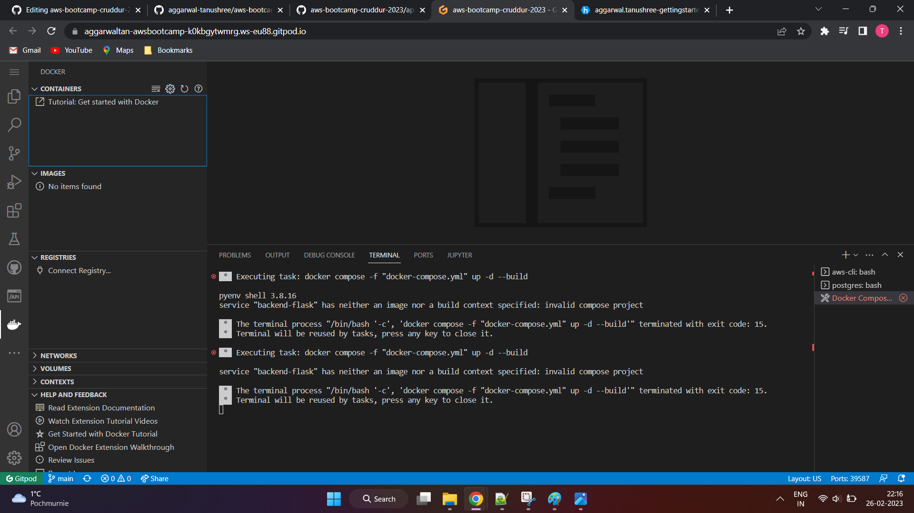

# Week 2 — Distributed Tracing
# Week 2 Journal 

## Task status
1. Watch Week 2 Live-Stream [Video](https://www.youtube.com/watch?v=2GD9xCzRId4&list=PLBfufR7vyJJ7k25byhRXJldB5AiwgNnWv&index=30) ✅
2. Watch Chirag Week 2 - Spending Considerations
3. Watched Ashish's Week 2 - Observability Security Considerations [video](https://www.youtube.com/watch?v=bOf4ITxAcXc&list=PLBfufR7vyJJ7k25byhRXJldB5AiwgNnWv&index=31) ✅
4. Instrument Honeycomb with [OTEL](https://www.youtube.com/watch?v=2GD9xCzRId4&list=PLBfufR7vyJJ7k25byhRXJldB5AiwgNnWv&index=30) ✅
5. Instrument AWS [X-Ray](https://www.youtube.com/watch?v=n2DTsuBrD_A&list=PLBfufR7vyJJ7k25byhRXJldB5AiwgNnWv&index=32)
6. Configure custom logger to send to CloudWatch [Logs](https://www.youtube.com/watch?v=ipdFizZjOF4&list=PLBfufR7vyJJ7k25byhRXJldB5AiwgNnWv&index=33)
7. Integrate Rollbar and capture and [error](https://www.youtube.com/watch?v=xMBDAb5SEU4&list=PLBfufR7vyJJ7k25byhRXJldB5AiwgNnWv&index=35)
8. Submit Security quiz ✅
9. Submit Spend considerations quiz 

====================================================================================

## Personal Milestones  👯
1.

====================================================================================

## Week 2 assignment proof


**Note** : I have documented each of these tasks in great detail [here](#detailed-documentation)

[Ashish's security considerations](#security-considerations)

====================================================================================

## Issues faced 😰 :x: warning: :no_entry:

[Docker image not found for my backend code](#error-backend-image-not-found)

====================================================================================


## Detailed documentation

## Configuring a Honeycomb Trace!

1. Create a new _Workspace_ and name it _Cruddur_ in your [Honeycomb account](https://ui.honeycomb.io/aggarwal.tanushree-gettingstarted/environments)

2. HoneyComb will automatically assign an **API key** to this workpace. _HoneyComb API keys are workspace spevific. The key we using in our application, determines which HoneyComb workspace it will be logged against.

3. Copy the Cruddur workspace API key from your HoneyComb. We need to set it as a GitPod environment variable. Use the below commands to set the env vars. 

```sh
export HONEYCOMB_API_KEY="mCNpsrEHKPRoNIu0JFn3MC"	
gp env HONEYCOMB_API_KEY="mCNpsrEHKPRoNIu0JFn3MC"	
```

4. Next, we will be adding a few env vars to our **backend-flask docker-compose.yml** file. These will be used to configure OpenTelemetry to send events to Honeycomb
The header `x-honeycomb-team` is your API key. Your service name will be used as the Service Dataset in Honeycomb, which is where data is stored. The service name is specified by `OTEL_SERVICE_NAME` .

```yml
OTEL_SERVICE_NAME: 'backend-flask'
OTEL_EXPORTER_OTLP_ENDPOINT: "https://api.honeycomb.io"
OTEL_EXPORTER_OTLP_HEADERS: "x-honeycomb-team=${HONEYCOMB_API_KEY}"
```


5. Add the below packages to your _backend-flask/requirements.txt_ (these packages will be used to intrument our Flask application with OpenTelemetry)

_Note : we can check the requirements for any programming language from the [Honeycomb docs](https://docs.honeycomb.io/getting-data-in/opentelemetry/)
```txt
opentelemetry-api 
opentelemetry-sdk 
opentelemetry-exporter-otlp-proto-http 
opentelemetry-instrumentation-flask 
opentelemetry-instrumentation-requests
```

6. Let's install the above packages via the terminal using the below commands

``` sh
cd backend-flask/
pip install -r requirements.txt
```


7. Add the below line to _app.py_ . These updates will create and initialize a tracer and Flask instruction, that will enable sending data to our _Honeycomb workspace_

Add these just below the existing "import" statements
```py
# HoneyComb ---------
from opentelemetry import trace
from opentelemetry.instrumentation.flask import FlaskInstrumentor
from opentelemetry.instrumentation.requests import RequestsInstrumentor
from opentelemetry.exporter.otlp.proto.http.trace_exporter import OTLPSpanExporter
from opentelemetry.sdk.trace import TracerProvider
from opentelemetry.sdk.trace.export import BatchSpanProcessor

# HoneyComb ---------
# Initialize tracing and an exporter that can send data to Honeycomb
provider = TracerProvider()
processor = BatchSpanProcessor(OTLPSpanExporter())
provider.add_span_processor(processor)
```
=== Optional block begins ===

Additonally, we can also log the OpenTelemetry logs to our backend app STDOUT. This can be helpful in troubleshooting Honeycomb issues, in case we run into them.

In case you proceed with this configuration, you will need to import the corresponding packages as well

` from opentelemetry.sdk.trace.export import ConsoleSpanExporter, SimpleSpanProcessor `

```py
# Show this in the logs within the backend-flask app (STDOUT)
simple_processor = SimpleSpanProcessor(ConsoleSpanExporter())
provider.add_span_processor(simple_processor)

trace.set_tracer_provider(provider)
tracer = trace.get_tracer(__name__)
```
=== Option block ends ===

Add these just below the existing "app = Flask(__name__)"

```py

# HoneyComb ---------
# Initialize automatic instrumentation with Flask
FlaskInstrumentor().instrument_app(app)
RequestsInstrumentor().instrument()
```


8. Run and Test

In the terminal, execute the below commands:

```sh
cd ../frontend-react-js
npm i
cd ..
```

Then,
Right click _docker-compose.yml_ -> _Compose up_ (alternately run _docker compose_ command on the terminal)


**Fun side note** : honeycomb-whoami.glitch.me is an app developed by Jessica, it can be used to check whom an API key belongs to 
Glich is a development environment, entirely online. It is used to host small _Node_ projects.
You can "fork" others Glich apps and do a _remix_ , this will spin up a copy of that app, and you can modify it as per your usecase.
Basically, a fun place to start coding for beginners.


**Oh No!!!!! We have run into an issue!**

#### Error Backend image not found



:red_circle: Looks like we broke something while updating our files today!

:red_circle: Read and re-read the error message! What does it say?  Google it to understand the possible scenarios such an issue can occur.

:red_circle: Let's go back and re-trace our steps.

:red_circle: Which files we updated today, what code was added? 

:red_circle: Did we accidently delete something?

:red_circle: Let's check the commit history to see our recent changes.

**Personal commentary** :memo:
:pencil: :memo:
:pencil:

```txt
Everything looks in order!! What did I do wrong?

At this stage i tried closing GitPod workpace and reopen and tried docker compose again, but the issue persisted.
I went back to Andrew's repo and compared the code line by line with mine, and still everything looked the same to me
I started panicking and thought of rolling back all commits made today
While I was sitting and comtemplating, and staring at the screen, something didn't look right

It suddently struck me that I was working with a YAML file. I had previously faced issues with YAML in my office work, where a line of code was wrongly indented.
And just like that I saw my mistake!
```


`build: ./backend-flask` was accidently added to the `environment` block. The error message made a lot more sense to me now!

```yml
environment:
      FRONTEND_URL: "https://3000-${GITPOD_WORKSPACE_ID}.${GITPOD_WORKSPACE_CLUSTER_HOST}"
      BACKEND_URL: "https://4567-${GITPOD_WORKSPACE_ID}.${GITPOD_WORKSPACE_CLUSTER_HOST}"
      OTEL_SERVICE_NAME: 'backend-flask'
      OTEL_EXPORTER_OTLP_ENDPOINT: "https://api.honeycomb.io"
      OTEL_EXPORTER_OTLP_HEADERS: "x-honeycomb-team=${HONEYCOMB_API_KEY}"
      build: ./backend-flask
 ```   
    
:green_circle: Let us correct the indentation of `build: ./backend-flask`

```yml
backend-flask:
    environment:
      FRONTEND_URL: "https://3000-${GITPOD_WORKSPACE_ID}.${GITPOD_WORKSPACE_CLUSTER_HOST}"
      BACKEND_URL: "https://4567-${GITPOD_WORKSPACE_ID}.${GITPOD_WORKSPACE_CLUSTER_HOST}"
      OTEL_SERVICE_NAME: 'backend-flask'
      OTEL_EXPORTER_OTLP_ENDPOINT: "https://api.honeycomb.io"
      OTEL_EXPORTER_OTLP_HEADERS: "x-honeycomb-team=${HONEYCOMB_API_KEY}"
    build: ./backend-flask
    ports:
      - "4567:4567"
    volumes:
      - ./backend-flask:/backend-flask
```

Let us _compose up_ our docker-compose.yml file again, to reflect the updated [app.py](https://github.com/aggarwal-tanushree/aws-bootcamp-cruddur-2023/blob/110f11ddac3f5c894c60bcbe6eb53eabd40fd4bc/backend-flask/app.py)

 

**It worked this time! Good job troubleshooting and fixing the issue!**


9. Add the following in your _gitpod.yml_ , to automatically unlock the frontend and backend ports (so you don not need to unlock them manually from GitPod 'ports' tab every time you compose docker). These will take effect the next time our GitPod workspace is loaded.

```yml
ports:
  - name: frontend
    port: 3000
    onOpen: open-browser
    visibility: public
  - name: backend
    port: 4567
    visibility: public
  - name: xray-daemon
    port: 2000
    visibility: public
```
_Note: 
Ports are now unlocked automatically_ 
Our gitpod.yml took effect too, since we had closed and re-launched our GitPod environment.


10. Let's verify our trace in the Honeycomb UI


We see data in our honeycomb workspace! We can see a few traces available from our Backend API endpoint "/api/activities/home"


Remember we had enabled STDOUT logging for Telemetry? Let's check if any logs were created!
From the Docker extension, click on the backend container, and select "view logs"
Scroll through the logs to check.

We see Telemetry logs! Good job!


As of now, we have created a `Trace` with a single `Span` at the _root_ level.

#### Next up,  let's create a **Span** for our Trace! 
We will be hardcoding the values sent to our Trace, since our app is not integrated to the database as of now.

We are creating this spam for our _HomeActivities_ run endpoint.

###### Acquiring a Tracer
Add the below code to [backend-flask/services/home_activities.py](https://github.com/aggarwal-tanushree/aws-bootcamp-cruddur-2023/blob/d446ef79edba1f70f9b39e98fb93fb6b2632149f/backend-flask/services/home_activities.py)
Add this line at the beginning of the file where the other _imports_ are happening, since these are global declarations.

```py
from opentelemetry import trace
tracer = trace.get_tracer("home.activities")
```

_Note:_
To create spans, you need to get a `Tracer`.
When you create a Tracer, OpenTelemetry requires you to give it a name as a string. This string is the only required parameter. 
When traces are sent to Honeycomb, the name of the Tracer is turned into the `library.name` field, which can be used to show all spans created from a particular tracer.
We are naming our `library` _home activities_


###### Creating Spans

Add the code inside _def run()_

```py
with tracer.start_as_current_span("home-activities-mock-data"):
```	
Indent the contents of _def run()_ so they are _inside_ the _tracer_
`_home-activities-mock-data_` is the name we are giving to our Span.

This add an extra variable in our Python code and passes all our code to it, which in turn will return it to our Honeycomb Trace.


###### Adding Attributes to Spans 
Now let's add some attributes to our _home-activities-mock-data spam_ , so we have some more filter fields to check. **These can be a good replacement to checking and tracing log files manually**
```py
      span = trace.get_current_span()
```     
	  _add the below line of code after the datetime function_
```py
      span.set_attribute("app.now", now.isoformat())
```
Add another Spam for the length of the string being returned by this function.
This needs to be added just before the _return statement_

```py
span.set_attribute("app.result_length", len(results))
```

After adding all these pieces of code, our final _home_activities.py_ would look like this:

```py
from datetime import datetime, timedelta, timezone
from opentelemetry import trace

tracer = trace.get_tracer("home.activities")

class HomeActivities:
  def run():
    with tracer.start_as_current_span("home-activites-mock-data"):
      span = trace.get_current_span()
      now = datetime.now(timezone.utc).astimezone()
      span.set_attribute("app.now", now.isoformat())
      results = [{
      'uuid': '68f126b0-1ceb-4a33-88be-d90fa7109eee',
      'handle':  'Tanushree Aggarwal',
      'message': 'Cloud is fun!',
      'created_at': (now - timedelta(days=2)).isoformat(),
      'expires_at': (now + timedelta(days=5)).isoformat(),
      'likes_count': 5,
      'replies_count': 1,
      'reposts_count': 0,
      'replies': [{
        'uuid': '26e12864-1c26-5c3a-9658-97a10f8fea67',
        'reply_to_activity_uuid': '68f126b0-1ceb-4a33-88be-d90fa7109eee',
        'handle':  'Worf',
        'message': 'So is Honeycomb tracing!',
        'likes_count': 0,
        'replies_count': 0,
        'reposts_count': 0,
        'created_at': (now - timedelta(days=2)).isoformat()
      }],
    },
    {
      'uuid': '66e12864-8c26-4c3a-9658-95a10f8fea67',
      'handle':  'Worf',
      'message': 'These traces are so cool!',
      'created_at': (now - timedelta(days=7)).isoformat(),
      'expires_at': (now + timedelta(days=9)).isoformat(),
      'likes': 0,
      'replies': []
    },
    {
      'uuid': '248959df-3079-4947-b847-9e0892d1bab4',
      'handle':  'Garek',
      'message': 'My dear doctor, I am just simple tailor',
      'created_at': (now - timedelta(hours=1)).isoformat(),
      'expires_at': (now + timedelta(hours=12)).isoformat(),
      'likes': 0,
      'replies': []
    }
    ]
    span.set_attribute("app.result_length", len(results))
    return results
```

Let's docker compose our _docker-compose.yml_ 
Let's hit our backend URL and few times, and then make our way to the HoneyComb UI and check if our Traces populated data.


And both our Spans return data to our Trace! Hooray!!


#### All about Logging!

Suppose you have a traditional application, say running on your laptopp. If something goes wrong and the application is not loading, and you start refrehing the app, still nothing happens... How do you check what's wrong?
This is where log monitoring comes into the picture!

- **Monolith Application** = traditional application, everything/all code is in one place. Everything is tightly coupled.
- **Microservice Application** = loosely coupled modules, hosted separately


Analysing logs is really time consuming!
Alert Fatigue for Application teams (SREs and DevOps) = due to the sheer volume of logs. They have to find a needle in a truckload of logs, and often they are not aware of the application flow.


**Why Observability**
- Possibly reduces _Alert Fatigue_ for Security Ops teams
- reduces cost in resolving same issue again and again
- visibility to end-to-end logs, metrics and tracing
- is at looking at the picture as a whole, thus increasing collaboration between teams
- can be as simple as checking the application health

**Observability v/s Monitoring**


Monitoring
eg: some monitoring script/tool that will refresh the app every 5 seconds to check health
- can be difficult for large complex apps, where multiple components/ systems are connected to each other. It gets difficult to track which part you are dependent on, which part has an issue etc.

Observability
- visibility on entire lifecycle of a service
- the way you would break down the entire application into processes and have a trace of exactly where the function is calling, where it is traversing the data, where its going for logging, what metric is being used.

**Three Pillars of Observability**
1. Metrics
2. Traces
3. Logs

**Metrics**
- a way to enhance the logs being produced
- eg: how often does a certain issue happens, why does it happen etc.

**Trace**
- being able to trace and pin-point to the cause of something
-

**AWS Observability Services**
1. AWS CloudWatch Logs
2. AWS CloudWatch Metrics
3. AWS X-ray Traces

**Observability Instrumentation**

_Instrumentation_ helps create or proceduce logs, metrics and traces; usually **CloudWatch agent, X-ray agent or AWS distribution for OpenTelemetry**


**Amazon Detective**
- a service that helps you identify security issues and investigate them
- supported by other AWS services in the backend, like - Amazon Macie (for sensitive data scanning in S3 buckets), Amazon GuardDuty(threat detection, continuous monitoring), Amazon Inspector, AWS Securty Hub(manage compliance and security) etc.


