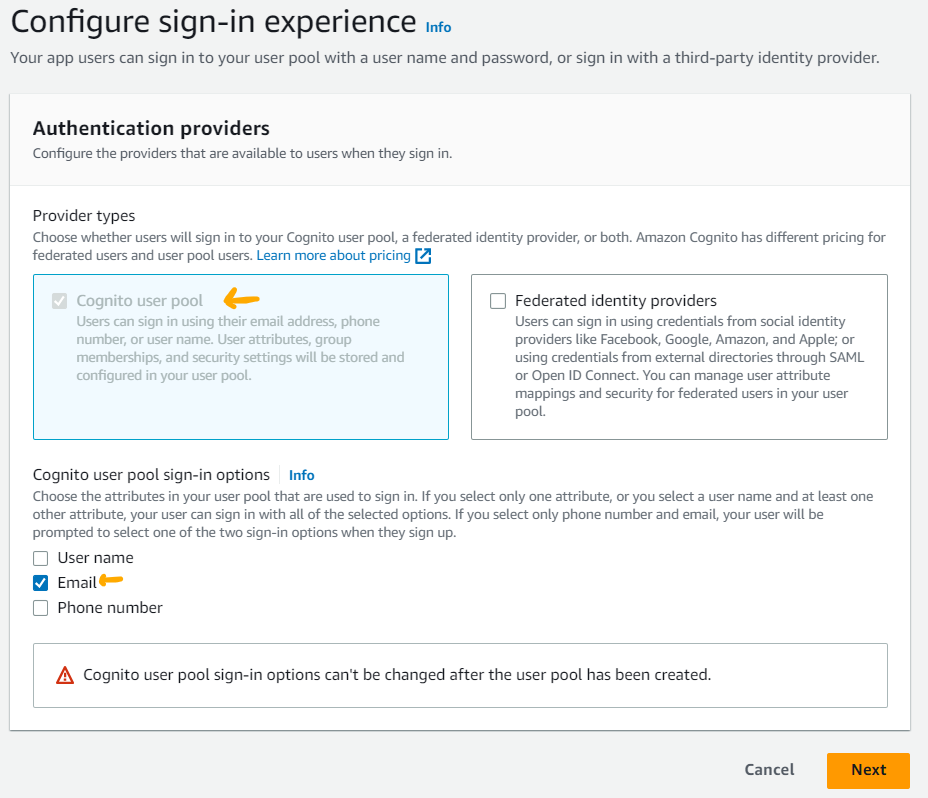
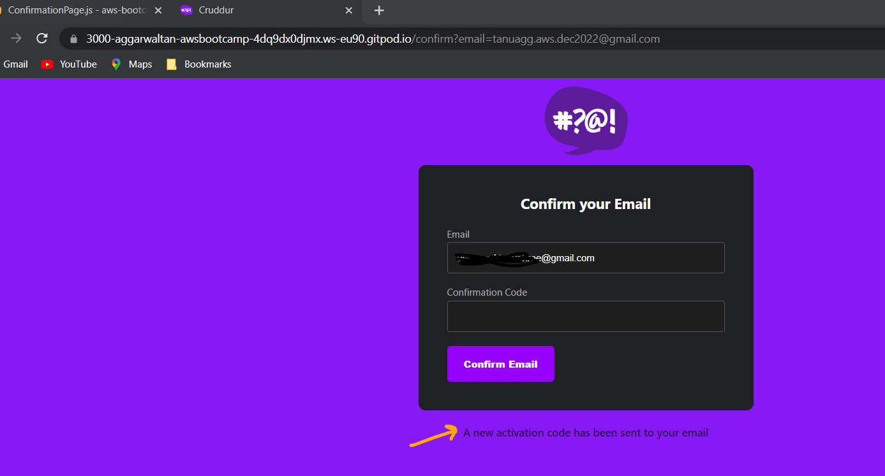
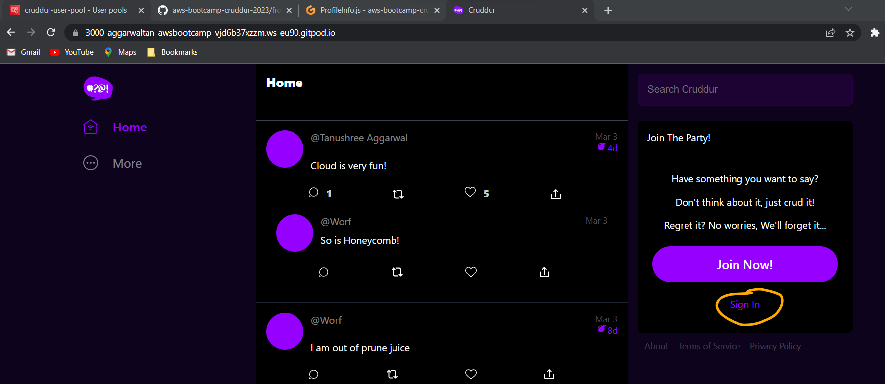

# Week 3 — Decentralized Authentication

# Week 3 Journal 

## Task status
1. Watch Week 3 Live-Stream [Video](https://www.youtube.com/watch?v=9obl7rVgzJw&list=PLBfufR7vyJJ7k25byhRXJldB5AiwgNnWv&index=41) ✅
2. Watch Chirag Week 3 - Spending Considerations :x: (not uploaded)
3. Watched Ashish's Week 3 - Decentralized authentication Security Considerations [video](https://www.youtube.com/watch?v=tEJIeII66pY&list=PLBfufR7vyJJ7k25byhRXJldB5AiwgNnWv&index=39) ✅
4. Setup Cognito User Pool ✅
5. Implement Custom Signin Page ✅
6. Implement Custom Signup Page ✅
7. Implement Custom Confirmation Page ✅
8. Implement Custom Recovery Page ✅
9. Watch about different approaches to verifying JWTs [video](https://www.youtube.com/watch?v=nJjbI4BbasU&list=PLBfufR7vyJJ7k25byhRXJldB5AiwgNnWv&index=43) - Pending
10. Submit Security quiz :x: 
11. Submit Spend considerations quiz :x: (not uploaded)

====================================================================================

## Week 3 Assignment Proof

| 	| Topic	| Assignment Proof 	|
|---	|--------------------------------	|--------------------------------------------	|
| 1 	| Setup Cognito User Pool 	| [journal](#setup-cognito-user-pool) 	|
| 2 	| Implement Custom Signin Page                	|  [journal](#implement-custom-signin-page)              	|
| 3 	| Implement Custom Signup Page                |  [journal](#implement-custom-signup-page)  |
| 4 	| Implement Custom Confirmation Page  	|  [journal](#implement-custom-confirmation-page) 	|
| 5     | Implement Custom Recovery Page |  [journal](#implement-custom-recovery-page) |
| 6	| Spend Considerations | [journal](#week-3-spend-considerations) |
| 7	| Security Considerations | [journal](#week-3-security-considerations) |


====================================================================================

## Stretch Assignments
- none so far
====================================================================================

## Personal Milestones  👯

====================================================================================

## Issues faced 😰 :x: :warning: :no_entry:


====================================================================================


## Detailed documentation

### Setup Cognito User Pool
1. Create a Cognito User Pool
- From the Hanmurger icon, navigate to `Cognito`
- Click `Create user pool`
	- Select `Cognito user pool`
	-  For the "Cognito user pool sign-in options" select `Email` and click `Next`
	
	
	
	- For the "Password Policy", leave as default `Cognito defaults`
	- For "Multi-factor authentication" select `No MFA` (as we do not want to incurr changes for SNS)
	- For "User account recovery" select `Enable self-service account recovery - Recommended` and delivery mechanism as `Email only`
	- Click Next
	
	
	
	
	
	- At the "Self-service sign-up", select `Enable self-registration`
	- "Attribute verification and user account confirmation" , select the recommended setting `Allow Cognito to automatically send messages to verify and confirm - Recommended`
	- For the attribute verification choose `Send email message, verify email address`
	- For "Verifying attribute changes", select the recommended setting `Keep original attribute value active when an update is pending - Recommended`, and `Email address`
	- For the "Required attributes", select `name` and `preferred_username`, click Next
	
	
	
	
	- At the next step we "Configure message delivery" options. Select 	`Send email with Cognito` and leave the other values as default. Click Next
	
	
	
	- Let's integrate our app!
	- Enter a relevant `User pool name`, we are naming it `cruddur-user-pool`
	_Note: Your user pool name can't be changed once this user pool is created._
	
	- For `Hosted authentication pages` leave `Use the Cognito Hosted UI` **unchecked** , we will not be using it.
	- For `Initial app client` let's set the the App type as `Public client`
	- Enter an `App client name` : `cruddur`
	- For the `Client secret` select `Don't generate a client secret` . Client secrets are used by the server-side component of an app to authorize API requests. Using a client secret can prevent a third party from impersonating your client.
	  
	  _Note: As we do not plan on any authentications at server-side we are not generating a client secret_
	  
	- Leave the `Advanced app client settings` and 	`Attribute read and write permissions` settings as default .  Click Next

	
	
	- Review the settings and then click `Create user pool`
	
	
	
Well done! You have created your Cognito user pool for Cruddur app!


2. Let's create a user for our cognito user pool

- In the `users` tab under your `Cognito user pool`, click `Create a user`
- Enter the preferred `username` , `email` and a `password` as per the defined password policy. Make sure to also select `verify the email`.
We will be using this user to verfiy if the login feature of our app is working or not.


1. Launch your Cruddur repo in GitPod
2. Install AWS Amplify

```sh
cd frontend-react-js
npm i aws-amplify --save	
cd ..
```

_Note: --save ensures that aws-amplify also gets added to our package.json_


3. Next, we hook up our cognito pool to our code in the [frontend-react-js/src/App.js](https://github.com/aggarwal-tanushree/aws-bootcamp-cruddur-2023/blob/44cbe05e8ea9bdd3287053a5c40a928cb6e31c92/frontend-react-js/src/App.js)

```js
import { Amplify } from 'aws-amplify';

Amplify.configure({
  "AWS_PROJECT_REGION": process.env.REACT_APP_AWS_PROJECT_REGION,
  "aws_cognito_region": process.env.REACT_APP_AWS_COGNITO_REGION,
  "aws_user_pools_id": process.env.REACT_APP_AWS_USER_POOLS_ID,
  "aws_user_pools_web_client_id": process.env.REACT_APP_CLIENT_ID,
  "oauth": {},
  Auth: {
    // We are not using an Identity Pool
    region: process.env.REACT_APP_AWS_PROJECT_REGION,           // REQUIRED - Amazon Cognito Region
    userPoolId: process.env.REACT_APP_AWS_USER_POOLS_ID,         // OPTIONAL - Amazon Cognito User Pool ID
    userPoolWebClientId: process.env.REACT_APP_CLIENT_ID,   // OPTIONAL - Amazon Cognito Web Client ID (26-char alphanumeric string)
  }
});	
```

4. Set the **frontend env vars** in `docker-compose.yml` which will be read by the above piece of code.	
	
REACT_APP_AWS_PROJECT_REGION: "${AWS_DEFAULT_REGION}"
REACT_APP_AWS_COGNITO_REGION: "${AWS_DEFAULT_REGION}"
REACT_APP_AWS_USER_POOLS_ID: "eu-central-1_xxxxxxx"
REACT_APP_CLIENT_ID: "xxxxxxxxxxxxx"

_Note: to get the REACT_APP_CLIENT_ID follow these steps:_

- click the newly created user pool on your AWS Management console, and navigate to the `App integration` tab.
- scroll down to reach `App client defaults` and grab the `Client ID`


5. To enable conditional show of components (if you are authenticated and logged in, it will show certain components, and in case you are not logged in, it will display some other components)
5.1 Go to the [frontend-react-js/src/pages/HomeFeedPage.js](https://github.com/aggarwal-tanushree/aws-bootcamp-cruddur-2023/blob/44cbe05e8ea9bdd3287053a5c40a928cb6e31c92/frontend-react-js/src/pages/HomeFeedPage.js) and add the below piece of code:

```js
//under imports
import { Auth } from 'aws-amplify';

```

Replace exisitng authentication code with the below piece of code (replacing line 40-48 og HomeFeedPage.js
Replace `exisitng code` with `new code`

Existing code:
```js
    // [TODO] Authenication
    if (Cookies.get('user.logged_in')) {
      setUser({
        display_name: Cookies.get('user.name'),
        handle: Cookies.get('user.username')
      })
    }
  };
```

New code:
```js
  const checkAuth = async () => {
    Auth.currentAuthenticatedUser({
      // Optional, By default is false. 
      // If set to true, this call will send a 
      // request to Cognito to get the latest user data
      bypassCache: false 
    })
    .then((user) => {
      console.log('user',user);
      return Auth.currentAuthenticatedUser()
    }).then((cognito_user) => {
        setUser({
          display_name: cognito_user.attributes.name,
          handle: cognito_user.attributes.preferred_username
        })
    })
    .catch((err) => console.log(err));
  };
  
 
5.2 Update [frontend-react-js/src/components/ProfileInfo.js](https://github.com/aggarwal-tanushree/aws-bootcamp-cruddur-2023/blob/44cbe05e8ea9bdd3287053a5c40a928cb6e31c92/frontend-react-js/src/components/ProfileInfo.js) 

Replace `exisitng code` with `new code`

Existing code
```js
// [TODO] Authenication
import Cookies from 'js-cookie'
```

New code
```js
// [TODO] Authenication
import { Auth } from 'aws-amplify';
```


Existing code
```js
  const signOut = async () => {
    console.log('signOut')
    // [TODO] Authenication
    Cookies.remove('user.logged_in')
    //Cookies.remove('user.name')
    //Cookies.remove('user.username')
    //Cookies.remove('user.email')
    //Cookies.remove('user.password')
    //Cookies.remove('user.confirmation_code')
    window.location.href = "/"
  }
```

New code
```js
const signOut = async () => {
    try {
        await Auth.signOut({ global: true });
        window.location.href = "/"
        localStorage.removeItem("access_token")
    } catch (error) {
        console.log('error signing out: ', error);
    }
  }
``` 

### Implement Custom Signin Page
5.3 Update [/frontend-react-js/src/pages/SigninPage.js](https://github.com/aggarwal-tanushree/aws-bootcamp-cruddur-2023/blob/44cbe05e8ea9bdd3287053a5c40a928cb6e31c92/frontend-react-js/src/pages/SigninPage.js)

Replace `exisitng code` with `new code`

Existing code
```js
// [TODO] Authenication
import Cookies from 'js-cookie'
```

New code
```js
// [TODO] Authenication
import { Auth } from 'aws-amplify';
```


Existing code
```js
const onsubmit = async (event) => {
    event.preventDefault();
    setErrors('')
    console.log('onsubmit')
    if (Cookies.get('user.email') === email && Cookies.get('user.password') === password){
      Cookies.set('user.logged_in', true)
      window.location.href = "/"
    } else {
      setErrors("Email and password is incorrect or account doesn't exist")
    }
    return false
  }
```

New code
```js
const onsubmit = async (event) => {
    setErrors('')
    event.preventDefault();
    Auth.signIn(email, password)
    .then(user => {
      console.log('user',user)
      localStorage.setItem("access_token", user.signInUserSession.accessToken.jwtToken)
      window.location.href = "/"
    })
    .catch(error => { 
      if (error.code == 'UserNotConfirmedException') {
        window.location.href = "/confirm"
      }
      setErrors(error.message)
    });
    return false
  }
``` 


5.4 Commit and sync the updated code to your Git repo

5.5 `Compose up` the `docker-compose.yml` file and verify the frontend.


Our frontend launches! This is good progress!

Try signing in with dummy credentials. Our aim is to verify if the configured error is caught by our `catch` block.
 


Well done! We get an error message, which is what we were expecting!


Now try to sign-in with the correct credentials (the user we created in our Cognito user pool)


Something is not right! We will need to troubleshoot this issue.


5.5 At the terminal execute the below command to make the password permanent.
This is a workaround, since our user was created with a temporary password.
`aws cognito-idp admin-set-user-password --username xxxxxxxxxxxxxxxxxxxxx@gmail.com --password xxxxxxxxxxx --user-pool-id eu-central-1-xxxxxx --permanent`


Now try logging in with the defined username and password.


Try the `sign out` feature to check its working as expected.


5.6 Go back to the Cognito user name in the AWS management console and add a `name` and `preferred name` to your user.
Refresh the app to check if the defined `name` and `preferred name` gets displayed under the `@handle`


### Implement Custom Signup Page

1. Update the [frontend-react-js/src/pages/SignupPage.js](https://github.com/aggarwal-tanushree/aws-bootcamp-cruddur-2023/blob/195e093e5169fbc17f26097f203d574e88481311/frontend-react-js/src/pages/SignupPage.js)

replace 
```js
// [TODO] Authenication
import Cookies from 'js-cookie'
```

with 
```js
// [TODO] Authenication
import { Auth } from 'aws-amplify';
```

Replace old code:
```
  const onsubmit = async (event) => {
    event.preventDefault();
    console.log('SignupPage.onsubmit')
    // [TODO] Authenication
    Cookies.set('user.name', name)
    Cookies.set('user.username', username)
    Cookies.set('user.email', email)
    Cookies.set('user.password', password)
    Cookies.set('user.confirmation_code',1234)
    window.location.href = `/confirm?email=${email}`
    return false
  }
```


with new code
```js
const onsubmit = async (event) => {
    event.preventDefault();
    setErrors('')
    console.log('username',username)
    console.log('email',email)
    console.log('name',name)
    try {
      const { user } = await Auth.signUp({
        username: email,
        password: password,
        attributes: {
          name: name,
          email: email,
          preferred_username: username,
        },
        autoSignIn: { // optional - enables auto sign in after user is confirmed
          enabled: true,
        }
      });
      console.log(user);
      window.location.href = `/confirm?email=${email}`
    } catch (error) {
        console.log(error);
        setErrors(error.message)
    }
    return false
  }
 ``` 
 

 
 
### Implement Custom Confirmation Page
1. Update the [frontend-react-js/src/pages/ConfirmationPage.js](https://github.com/aggarwal-tanushree/aws-bootcamp-cruddur-2023/blob/195e093e5169fbc17f26097f203d574e88481311/frontend-react-js/src/pages/ConfirmationPage.js)

replace 
```js
// [TODO] Authenication
import Cookies from 'js-cookie'
```

with 
```js
// [TODO] Authenication
import { Auth } from 'aws-amplify';
```

Replace old `resent code` :
```js
  const resend_code = async (event) => {
    console.log('resend_code')
    // [TODO] Authenication
  }
```


with new `resend code`

```js
const resend_code = async (event) => {
    setErrors('')
    try {
      await Auth.resendSignUp(email);
      console.log('code resent successfully');
      setCodeSent(true)
    } catch (err) {
      // does not return a code
      // does cognito always return english
      // for this to be an okay match?
      console.log(err)
      if (err.message == 'Username cannot be empty'){
        setCognitoErrors("You need to provide an email in order to send Resend Activiation Code")   
      } else if (err.message == "Username/client id combination not found."){
        setCognitoErrors("Email is invalid or cannot be found.")   
      }
    }
  }
```  


Replace old `onsubmit code` :
```js
const onsubmit = async (event) => {
    event.preventDefault();
    console.log('ConfirmationPage.onsubmit')
    // [TODO] Authenication
    if (Cookies.get('user.email') === undefined || Cookies.get('user.email') === '' || Cookies.get('user.email') === null){
      setErrors("You need to provide an email in order to send Resend Activiation Code")   
    } else {
      if (Cookies.get('user.email') === email){
        if (Cookies.get('user.confirmation_code') === code){
          Cookies.set('user.logged_in',true)
          window.location.href = "/"
        } else {
          setErrors("Code is not valid")
        }
      } else {
        setErrors("Email is invalid or cannot be found.")   
      }
    }
    return false
  }
```


with new `onsubmit code`

```js
const onsubmit = async (event) => {
    event.preventDefault();
    setErrors('')
    try {
      await Auth.confirmSignUp(email, code);
      window.location.href = "/"
    } catch (error) {
      setErrors(error.message)
    }
    return false
  }
```  

verify `confirmation ` functionality


verify `resend activation code` functionality




### Implement Custom Recovery Page
1. Update the [frontend-react-js/src/pages/RecoverPage.js](https://github.com/aggarwal-tanushree/aws-bootcamp-cruddur-2023/blob/195e093e5169fbc17f26097f203d574e88481311/frontend-react-js/src/pages/RecoverPage.js)

Add import  
```js
import { Auth } from 'aws-amplify';
```

Replace 
```js
const onsubmit_send_code = async (event) => {
    event.preventDefault();
    console.log('onsubmit_send_code')
    return false
  }
  const onsubmit_confirm_code = async (event) => {
    event.preventDefault();
    console.log('onsubmit_confirm_code')
    return false
  }
```

with

```js
 const onsubmit_send_code = async (event) => {
    event.preventDefault();
    setErrors('')
    Auth.forgotPassword(username)
    .then((data) => setFormState('confirm_code') )
    .catch((err) => setErrors(err.message) );
    return false
  }
  const onsubmit_confirm_code = async (event) => {
    event.preventDefault();
    setErrors('')
    if (password == passwordAgain){
      Auth.forgotPasswordSubmit(username, code, password)
      .then((data) => setFormState('success'))
      .catch((err) => setErrors(err.message) );
    } else {
      setCognitoErrors('Passwords do not match')
    }
    return false
  }
```
 
verify `recovery` functionality

 

**Commit and sync the code to your Github repo. Stop the GitPod workspace**
  


### Implement server side authentication

1. Add in the [frontend-react-js/src/pages/HomeFeedPage.js](https://github.com/aggarwal-tanushree/aws-bootcamp-cruddur-2023/blob/e1ce912d596647fff67412a42d9f4959d124e3fa/frontend-react-js/src/pages/HomeFeedPage.js) a header to pass along the access token

Add the code in the `loaddata`	const

```js
  headers: {
    Authorization: `Bearer ${localStorage.getItem("access_token")}`
  }
``` 


2. Update the backend code to use `authentication tokens`

Update [backend-flask/app.py](https://github.com/aggarwal-tanushree/aws-bootcamp-cruddur-2023/blob/e1ce912d596647fff67412a42d9f4959d124e3fa/backend-flask/app.py)

2.1 Add `authentication token`
replace `exisitng code` with `new code`

existing code:
```
@app.route("/api/activities/home", methods=['GET'])
##X-Ray recorder
@xray_recorder.capture('activities_home')
def data_home():
  data = HomeActivities.run()
  return data, 200

```


new code
```py
@app.route("/api/activities/home", methods=['GET'])
##X-Ray recorder
@xray_recorder.capture('activities_home')
def data_home():
  access_token = extract_access_token(request.headers)
  try:
    claims = cognito_jwt_token.verify(access_token)
    # authenicatied request
    app.logger.debug("authenicated")
    app.logger.debug(claims)
    app.logger.debug(claims['username'])
    data = HomeActivities.run(cognito_user_id=claims['username'])
  except TokenVerifyError as e:
    # unauthenicatied request
    app.logger.debug(e)
    app.logger.debug("unauthenicated")
    data = HomeActivities.run()
  return data, 200
```

2.2 To add the `logger`
import `sys` to your `app.py`
__Note: "sys" is being used for by the app.logger. 
```py
import sys
```


2.3 Update `CORS` in `app.py`

replace `exisitng code` with `new code`

exisitng code:
```py
cors = CORS(
  app, 
  resources={r"/api/*": {"origins": origins}},
  expose_headers="location,link",
  allow_headers="content-type,if-modified-since",
  methods="OPTIONS,GET,HEAD,POST"
)
```

new code:

```py
cors = CORS(
  app, 
  resources={r"/api/*": {"origins": origins}},
  headers=['Content-Type', 'Authorization'], 
  expose_headers='Authorization',
  methods="OPTIONS,GET,HEAD,POST"
)
```


2.4 Update the [backend-flask/requirements.txt](https://github.com/aggarwal-tanushree/aws-bootcamp-cruddur-2023/blob/74681c0a7ea8912a197e94e670f72ed2d5ceb608/backend-flask/requirements.txt) file and add the below:

```sh
Flask-AWSCognito
```

2.5 Install the `Flask-AWSCognito` requirement.
At the terminal, execute the following:
```sh
cd backend-flask
pip install -r requirements.txt
cd ..
```


2.6 Add the below `env vars` to the `backend-flask` env var section of [docker-compose.yml](https://github.com/aggarwal-tanushree/aws-bootcamp-cruddur-2023/blob/74681c0a7ea8912a197e94e670f72ed2d5ceb608/docker-compose.yml)

```yml
AWS_COGNITO_USER_POOL_ID: "eu-central-1_xxxxxxx"
AWS_COGNITO_USER_POOL_CLIENT_ID: "xxxxxxxxxxxxxxxxxxxx"    
```


2.7 Create a new folder structure under `backend-flask` and name it `lib`


2.8 Create a new file [cognito_jwt_token.py](https://github.com/aggarwal-tanushree/aws-bootcamp-cruddur-2023/blob/74681c0a7ea8912a197e94e670f72ed2d5ceb608/backend-flask/lib/cognito_jwt_token.py) inside `lib` and add the below code to it:

```py
import time
import requests
from jose import jwk, jwt
from jose.exceptions import JOSEError
from jose.utils import base64url_decode

class FlaskAWSCognitoError(Exception):
  pass

class TokenVerifyError(Exception):
  pass

def extract_access_token(request_headers):
    access_token = None
    auth_header = request_headers.get("Authorization")
    if auth_header and " " in auth_header:
        _, access_token = auth_header.split()
    return access_token

class CognitoJwtToken:
    def __init__(self, user_pool_id, user_pool_client_id, region, request_client=None):
        self.region = region
        if not self.region:
            raise FlaskAWSCognitoError("No AWS region provided")
        self.user_pool_id = user_pool_id
        self.user_pool_client_id = user_pool_client_id
        self.claims = None
        if not request_client:
            self.request_client = requests.get
        else:
            self.request_client = request_client
        self._load_jwk_keys()


    def _load_jwk_keys(self):
        keys_url = f"https://cognito-idp.{self.region}.amazonaws.com/{self.user_pool_id}/.well-known/jwks.json"
        try:
            response = self.request_client(keys_url)
            self.jwk_keys = response.json()["keys"]
        except requests.exceptions.RequestException as e:
            raise FlaskAWSCognitoError(str(e)) from e

    @staticmethod
    def _extract_headers(token):
        try:
            headers = jwt.get_unverified_headers(token)
            return headers
        except JOSEError as e:
            raise TokenVerifyError(str(e)) from e

    def _find_pkey(self, headers):
        kid = headers["kid"]
        # search for the kid in the downloaded public keys
        key_index = -1
        for i in range(len(self.jwk_keys)):
            if kid == self.jwk_keys[i]["kid"]:
                key_index = i
                break
        if key_index == -1:
            raise TokenVerifyError("Public key not found in jwks.json")
        return self.jwk_keys[key_index]

    @staticmethod
    def _verify_signature(token, pkey_data):
        try:
            # construct the public key
            public_key = jwk.construct(pkey_data)
        except JOSEError as e:
            raise TokenVerifyError(str(e)) from e
        # get the last two sections of the token,
        # message and signature (encoded in base64)
        message, encoded_signature = str(token).rsplit(".", 1)
        # decode the signature
        decoded_signature = base64url_decode(encoded_signature.encode("utf-8"))
        # verify the signature
        if not public_key.verify(message.encode("utf8"), decoded_signature):
            raise TokenVerifyError("Signature verification failed")

    @staticmethod
    def _extract_claims(token):
        try:
            claims = jwt.get_unverified_claims(token)
            return claims
        except JOSEError as e:
            raise TokenVerifyError(str(e)) from e

    @staticmethod
    def _check_expiration(claims, current_time):
        if not current_time:
            current_time = time.time()
        if current_time > claims["exp"]:
            raise TokenVerifyError("Token is expired")  # probably another exception

    def _check_audience(self, claims):
        # and the Audience  (use claims['client_id'] if verifying an access token)
        audience = claims["aud"] if "aud" in claims else claims["client_id"]
        if audience != self.user_pool_client_id:
            raise TokenVerifyError("Token was not issued for this audience")

    def verify(self, token, current_time=None):
        """ https://github.com/awslabs/aws-support-tools/blob/master/Cognito/decode-verify-jwt/decode-verify-jwt.py """
        if not token:
            raise TokenVerifyError("No token provided")

        headers = self._extract_headers(token)
        pkey_data = self._find_pkey(headers)
        self._verify_signature(token, pkey_data)

        claims = self._extract_claims(token)
        self._check_expiration(claims, current_time)
        self._check_audience(claims)

        self.claims = claims 
        return claims
```


2.9 Add the below code after `app = Flask(__name__)` in `app.py`

import:
```py
from lib.cognito_jwt_token import CognitoJwtToken, extract_access_token, TokenVerifyError
```


```py
cognito_jwt_token = CognitoJwtToken(
  user_pool_id=os.getenv("AWS_COGNITO_USER_POOL_ID"), 
  user_pool_client_id=os.getenv("AWS_COGNITO_USER_POOL_CLIENT_ID"),
  region=os.getenv("AWS_DEFAULT_REGION")
)
```


2.10 Update [backend-flask/services/home_activities.py](https://github.com/aggarwal-tanushree/aws-bootcamp-cruddur-2023/blob/e1ce912d596647fff67412a42d9f4959d124e3fa/backend-flask/services/home_activities.py) to display certain data only when authenticated

replace `exisitng code` with `new code`

existing code:

```py
class HomeActivities:
  def run():
  ## diabling cloudwatch logging to save on spend  
  #def run(logger): 
    #logger.info("HomeActivities")

```	  
new code
```py
class HomeActivities:
  def run(cognito_user_id=None):
  ## diabling cloudwatch logging to save on spend  
  #def run(logger): 
    #logger.info("HomeActivities")
```


Add a new crud to `home_activities.py` which is displayed only when our access token is validated (this is a temporary manual validation step, till we add the remaining functionality to our app)

```py
      if cognito_user_id != None:
        extra_crud = {
          'uuid': '248959df-3079-4947-b847-9e0892d1bab4',
          'handle':  'Lore',
          'message': 'My dear brother, it the humans that are the problem',
          'created_at': (now - timedelta(hours=1)).isoformat(),
          'expires_at': (now + timedelta(hours=12)).isoformat(),
          'likes': 1042,
          'replies': []
        }
        results.insert(0,extra_crud)
```


2.11 Remove the `access token` from local storage when we `sign out`
[frontend-react-js/src/components/ProfileInfo.js](https://github.com/aggarwal-tanushree/aws-bootcamp-cruddur-2023/blob/e1ce912d596647fff67412a42d9f4959d124e3fa/frontend-react-js/src/components/ProfileInfo.js)

replace `exisitng code` with `new code`

existing code
```js
 const signOut = async () => {
    try {
        await Auth.signOut({ global: true });
        window.location.href = "/"
    } catch (error) {
        console.log('error signing out: ', error);
    }
  }
  
  
new code
```js
 const signOut = async () => {
    try {
        await Auth.signOut({ global: true });
        window.location.href = "/"
        localStorage.removeItem("access_token")
    } catch (error) {
        console.log('error signing out: ', error);
    }
  }
```


2.12 `compose up` the `docker-compose.yml` 

Check the backend container logs.


Access the Frontend UI and login to the app. Check if `Lore's Crud` is displayed. This will only be displayed if our authentication token is successfully validated.


`Sign out` of the app to verify if `Lore's Crud` disappears.

It does! Sweet victory!!

Well done!



2.13 Commit and syc the code to your Github bootcamp repo.

====================================================================================

## Week 3 Security considerations
[Ashish's Decenteralized Authentication security considerations](https://www.youtube.com/watch?v=tEJIeII66pY&list=PLBfufR7vyJJ7k25byhRXJldB5AiwgNnWv&index=39)

====================================================================================

### Week 3 Spend Considerations

====================================================================================
