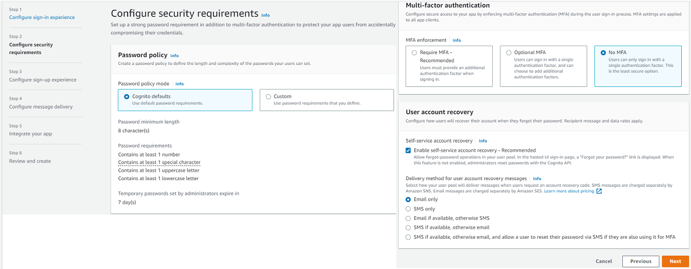

# Week 3 — Decentralized Authentication

# Week 3 Journal 

## Task status
1. Watch Week 3 Live-Stream [Video](https://www.youtube.com/watch?v=9obl7rVgzJw&list=PLBfufR7vyJJ7k25byhRXJldB5AiwgNnWv&index=41) ✅
2. Watch Chirag Week 3 - Spending Considerations
3. Watched Ashish's Week 3 - Decentralized authentication Security Considerations [video](https://www.youtube.com/watch?v=tEJIeII66pY&list=PLBfufR7vyJJ7k25byhRXJldB5AiwgNnWv&index=39)
4. Setup Cognito User Pool
5. Implement Custom Signin Page
6. Implement Custom Signup Page
7. Implement Custom Confirmation Page
8. Implement Custom Recovery Page
9. Watch about different approaches to verifying JWTs [video](https://www.youtube.com/watch?v=nJjbI4BbasU&list=PLBfufR7vyJJ7k25byhRXJldB5AiwgNnWv&index=43)
10. Submit Security quiz 
11. Submit Spend considerations quiz 

====================================================================================

## Week 3 Assignment Proof

| 	| Topic	| Assignment Proof 	|
|---	|--------------------------------	|--------------------------------------------	|
| 1 	| Setup Cognito User Pool 	| [journal](#setup-cognito-user-pool) 	|
| 2 	| Implement Custom Signin Page                	|  [journal](#implement-custom-signin-page)              	|
| 3 	| Implement Custom Signup Page                |  [journal](#integrate-rollbar-and-capture-an-error)  |
| 4 	| Implement Custom Confirmation Page  	|  [journal](#configure-custom-logger-to-send-to-cloudwatch-logs) 	|
| 5     | Implement Custom Recovery Page |  [journal](#configure-codespaces) |
| 6	| Spend Considerations | [journal](#week-3-spend-considerations) |
| 7	| Security Considerations | [journal](#week-3-security-considerations) |


====================================================================================

## Stretch Assignments

====================================================================================

## Personal Milestones  👯

====================================================================================

## Issues faced 😰 :x: :warning: :no_entry:


====================================================================================


## Detailed documentation

### Setup Cognito User Pool
1. Create a Cognito User Pool
- From the Hanmurger icon, navigate to `Cognito`
- Click `Create user pool`
	- Select `Cognito user pool`
	-  For the "Cognito user pool sign-in options" select `User name` and `Email` and click `Next`
	
	
	
	- For the "Password Policy", leave as default `Cognito defaults`
	- For "Multi-factor authentication" select `No MFA` (as we do not want to incurr changes for SNS)
	- For "User account recovery" select `Enable self-service account recovery - Recommended` and delivery mechanism as `Email only`
	- Click Next
	
	
	
	
	
	- At the "Self-service sign-up", select `Enable self-registration`
	- "Attribute verification and user account confirmation" , select the recommended setting `Allow Cognito to automatically send messages to verify and confirm - Recommended`
	- For the attribute verification choose `Send email message, verify email address`
	- For "Verifying attribute changes", select the recommended setting `Keep original attribute value active when an update is pending - Recommended`, and `Email address`
	- For the "Required attributes", select `name` and `preferred_username`, click Next
	
	
	
	
	- At the next step we "Configure message delivery" options. Select 	`Send email with Cognito` and leave the other values as default. Click Next
	
	
	
	- Let's integrate our app!
	- Enter a relevant `User pool name`, we are naming it `cruddur-user-pool`
	_Note: Your user pool name can't be changed once this user pool is created._
	
	- For `Hosted authentication pages` leave `Use the Cognito Hosted UI` **unchecked** , we will not be using it.
	- For `Initial app client` let's set the the App type as `Public client`
	- Enter an `App client name` : `cruddur`
	- For the `Client secret` select `Don't generate a client secret` . Client secrets are used by the server-side component of an app to authorize API requests. Using a client secret can prevent a third party from impersonating your client.
	  
	  _Note: As we do not plan on any authentications at server-side we are not generating a client secret_
	  
	- Leave the `Advanced app client settings` and 	`Attribute read and write permissions` settings as default .  Click Next

	
	
	- Review the settings and then click `Create user pool`
	
	
	
Well done! You have created your Cognito user pool for Cruddur app!


2. Let's create a user for our cognito user pool

- In the `users` tab under your `Cognito user pool`, click `Create a user`
- Enter the preferred `username` , `email` and a `password` as per the defined password policy. Make sure to also select `verify the email`.
We will be using this user to verfiy if the login feature of our app is working or not.


1. Launch your Cruddur repo in GitPod
2. Install AWS Amplify

```sh
cd frontend-react-js
npm i aws-amplify --save	
cd ..
```

_Note: --save ensures that aws-amplify also gets added to our package.json_


3. Next, we hook up our cognito pool to our code in the [frontend-react-js/src/App.js](https://github.com/aggarwal-tanushree/aws-bootcamp-cruddur-2023/blob/44cbe05e8ea9bdd3287053a5c40a928cb6e31c92/frontend-react-js/src/App.js)

```js
import { Amplify } from 'aws-amplify';

Amplify.configure({
  "AWS_PROJECT_REGION": process.env.REACT_APP_AWS_PROJECT_REGION,
  "aws_cognito_region": process.env.REACT_APP_AWS_COGNITO_REGION,
  "aws_user_pools_id": process.env.REACT_APP_AWS_USER_POOLS_ID,
  "aws_user_pools_web_client_id": process.env.REACT_APP_CLIENT_ID,
  "oauth": {},
  Auth: {
    // We are not using an Identity Pool
    region: process.env.REACT_APP_AWS_PROJECT_REGION,           // REQUIRED - Amazon Cognito Region
    userPoolId: process.env.REACT_APP_AWS_USER_POOLS_ID,         // OPTIONAL - Amazon Cognito User Pool ID
    userPoolWebClientId: process.env.REACT_APP_CLIENT_ID,   // OPTIONAL - Amazon Cognito Web Client ID (26-char alphanumeric string)
  }
});	
```

4. Set the **frontend env vars** in `docker-compose.yml` which will be read by the above piece of code.	
	
REACT_APP_AWS_PROJECT_REGION: "${AWS_DEFAULT_REGION}"
REACT_APP_AWS_COGNITO_REGION: "${AWS_DEFAULT_REGION}"
REACT_APP_AWS_USER_POOLS_ID: "eu-central-1_jXJqoM8dU"
REACT_APP_CLIENT_ID: "16fa2s1rk5v77hs6c6cn8men6i"

_Note: to get the REACT_APP_CLIENT_ID follow these steps:_

- click the newly created user pool on your AWS Management console, and navigate to the `App integration` tab.
- scroll down to reach `App client defaults` and grab the `Client ID`


5. To enable conditional show of components (if you are authenticated and logged in, it will show certain components, and in case you are not logged in, it will display some other components)
5.1 Go to the [frontend-react-js/src/pages/HomeFeedPage.js](https://github.com/aggarwal-tanushree/aws-bootcamp-cruddur-2023/blob/44cbe05e8ea9bdd3287053a5c40a928cb6e31c92/frontend-react-js/src/pages/HomeFeedPage.js) and add the below piece of code:

```js
//under imports
import { Auth } from 'aws-amplify';

```

Replace exisitng authentication code with the below piece of code (replacing line 40-48 og HomeFeedPage.js
Replace `exisitng code` with `new code`

Existing code:
```js
    // [TODO] Authenication
    if (Cookies.get('user.logged_in')) {
      setUser({
        display_name: Cookies.get('user.name'),
        handle: Cookies.get('user.username')
      })
    }
  };
```

New code:
```js
  const checkAuth = async () => {
    Auth.currentAuthenticatedUser({
      // Optional, By default is false. 
      // If set to true, this call will send a 
      // request to Cognito to get the latest user data
      bypassCache: false 
    })
    .then((user) => {
      console.log('user',user);
      return Auth.currentAuthenticatedUser()
    }).then((cognito_user) => {
        setUser({
          display_name: cognito_user.attributes.name,
          handle: cognito_user.attributes.preferred_username
        })
    })
    .catch((err) => console.log(err));
  };
  
 
5.2 Update [frontend-react-js/src/components/ProfileInfo.js](https://github.com/aggarwal-tanushree/aws-bootcamp-cruddur-2023/blob/44cbe05e8ea9bdd3287053a5c40a928cb6e31c92/frontend-react-js/src/components/ProfileInfo.js) 

Replace `exisitng code` with `new code`

Existing code
```js
// [TODO] Authenication
import Cookies from 'js-cookie'
```

New code
```js
// [TODO] Authenication
import { Auth } from 'aws-amplify';
```


Existing code
```js
  const signOut = async () => {
    console.log('signOut')
    // [TODO] Authenication
    Cookies.remove('user.logged_in')
    //Cookies.remove('user.name')
    //Cookies.remove('user.username')
    //Cookies.remove('user.email')
    //Cookies.remove('user.password')
    //Cookies.remove('user.confirmation_code')
    window.location.href = "/"
  }
```

New code
```js
const signOut = async () => {
    try {
        await Auth.signOut({ global: true });
        window.location.href = "/"
        localStorage.removeItem("access_token")
    } catch (error) {
        console.log('error signing out: ', error);
    }
  }
``` 

### Implement Custom Signin Page
5.3 Update [/frontend-react-js/src/pages/SigninPage.js](https://github.com/aggarwal-tanushree/aws-bootcamp-cruddur-2023/blob/44cbe05e8ea9bdd3287053a5c40a928cb6e31c92/frontend-react-js/src/pages/SigninPage.js)

Replace `exisitng code` with `new code`

Existing code
```js
// [TODO] Authenication
import Cookies from 'js-cookie'
```

New code
```js
// [TODO] Authenication
import { Auth } from 'aws-amplify';
```


Existing code
```js
const onsubmit = async (event) => {
    event.preventDefault();
    setErrors('')
    console.log('onsubmit')
    if (Cookies.get('user.email') === email && Cookies.get('user.password') === password){
      Cookies.set('user.logged_in', true)
      window.location.href = "/"
    } else {
      setErrors("Email and password is incorrect or account doesn't exist")
    }
    return false
  }
```

New code
```js
const onsubmit = async (event) => {
    setErrors('')
    event.preventDefault();
    Auth.signIn(email, password)
    .then(user => {
      console.log('user',user)
      localStorage.setItem("access_token", user.signInUserSession.accessToken.jwtToken)
      window.location.href = "/"
    })
    .catch(error => { 
      if (error.code == 'UserNotConfirmedException') {
        window.location.href = "/confirm"
      }
      setErrors(error.message)
    });
    return false
  }
``` 


5.4 Commit and sync the updated code to your Git repo

5.5 `Compose up` the `docker-compose.yml` file and verify the frontend.


Our frontend launches! This is good progress!

Try signing in with dummy credentials. Our aim is to verify if the configured error is caught by our `catch` block.
 


Well done! We get an error message, which is what we were expecting!


Now try to sign-in with the correct credentials (the user we created in our Cognito user pool)


Something is not right! We will need to troubleshoot this issue.


====================================================================================

## Week 3 Security considerations
[Ashish's Decenteralized Authentication security considerations](https://www.youtube.com/watch?v=tEJIeII66pY&list=PLBfufR7vyJJ7k25byhRXJldB5AiwgNnWv&index=39)

====================================================================================

### Week 3 Spend Considerations

====================================================================================
